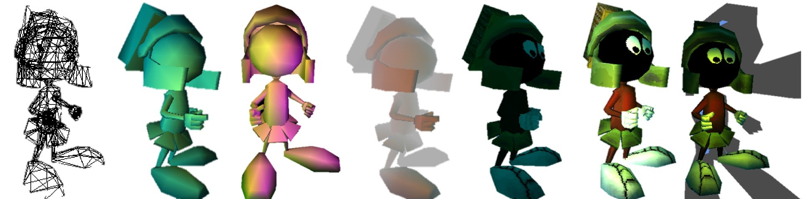

import { FontAwesomeIcon } from '@fortawesome/react-fontawesome'
import { faCamera, faVideo } from '@fortawesome/free-solid-svg-icons'
import RendererVideoOgv from '../vid/Intro3dDemo.ogv'
import RendererVideoMp4 from '../vid/Intro3dDemo.mp4'
import RendererVideoWebm from '../vid/Intro3dDemo.webm'

This project provided an appreciation of how 3D graphics APIs such as DirectX and OpenGL work under the covers. To do this, a software 
renderer (written in C++) was built up from scratch. The following concepts were covered:

- Geometric Transformations — How to get from model co-ordinates to screen co-ordinates a.k.a. the viewing pipeline.
- Vector maths — Calculating vectors from points, vector addition, vector length, dot product and cross product.
- Lighting — Ambient, directional, point and spot lighting.
- Reflection — Diffuse and specular (Phong/Blinn-Phong reflection models).
- Rasterisation — Gouraud shading.
- Texturing.
- Cameras & Viewpoints — The view frustum, polygon culling and clipping.

The evolution of Marvin image below demonstrates the progression of the renderer. It starts with a simple wireframe, progressing to flat 
shaded polygons (using GDI+), and ending with a custom Gouraud shader to smooth out the image. Lighting effects are then applied to modulate 
the overall appearance, and finally the model is textured.

<figcaption>
    <FontAwesomeIcon icon={faCamera} /> The evolution of Marvin the Martian showing each stage of the renderer as it progressed.
</figcaption>

The full evolution can be seen in the video along with an explanation of what is being demonstrated at each stage.

<video controls="controls">
    <source src={RendererVideoMp4} type='video/mp4; codecs="avc1.42E01E, mp4a.40.2"' />
    <source src={RendererVideoWebm} type='video/webm; codecs="vp8, vorbis"' />
    <source src={RendererVideoOgv} type='video/ogg; codecs="theora, vorbis"' />
    <iframe width="560" height="315" src="//www.youtube.com/embed/8fK-XdEcl08?rel=0"></iframe>
</video>
<figcaption>
    <FontAwesomeIcon icon={faVideo} /> Video demonstration of the software renderer in action.
</figcaption>

This was probably the most challenging project I have worked on to date, but ultimately it proved very rewarding as some really nice effects 
can be achieved. I really enjoyed the modular nature of how the project was built up, with a study of a particular algorithm, followed by its 
implementation. This allowed the application to be built up gradually, preventing it from becoming too overwhelming.