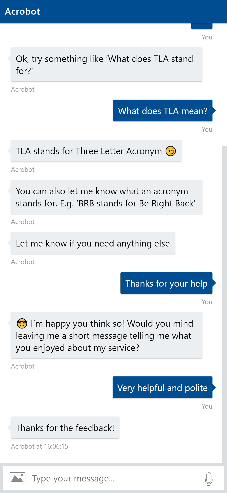
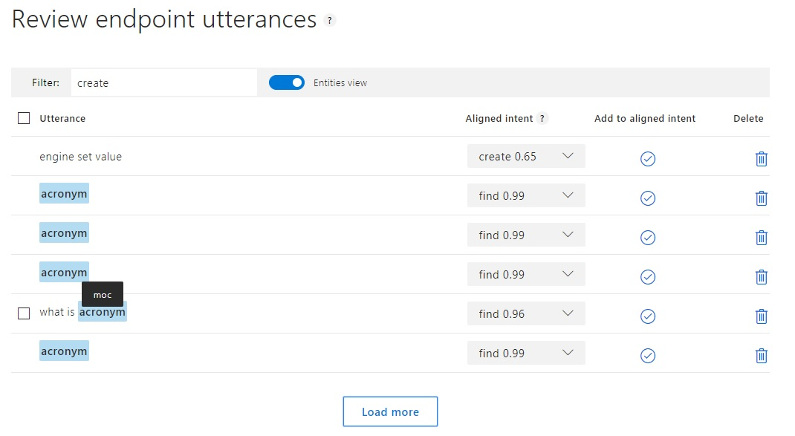

import { FontAwesomeIcon } from '@fortawesome/react-fontawesome'
import { faCamera, faVideo } from '@fortawesome/free-solid-svg-icons'
import HousewrkVideo from '../vid/housewrk.mp4'

Back in April 2017 I attended the [dotnetsheff](https://dotnetsheff.co.uk/) meetup [talk on chatbots](https://www.meetup.com/dotnetsheff/events/234854191) by 
the excellent [James Mann from Black Marble](https://blogs.blackmarble.co.uk/jmann/). His passion and knowledge meant I walked away from the talk desperate 
to try and create my own bots!

### Acrobot

As I was leaving the talk a friend suggested a great use case for a bot ‐ acronyms. Often the curse of most people’s work lives where you’re expected 
to know what they mean and are thrown about with abandon by people trying to sound intelligent. Well, no more!

Imagine sitting in a meeting and you hear an acronym, now you can simply take out your phone and get an explanation in seconds.

The bot was created using the Bot Framework C# SDK and uses LUIS.ai for the language recognition.

<figcaption>
    <FontAwesomeIcon icon={faCamera} /> Acrobot screenshot.
</figcaption>

#### LUIS

LUIS is a great option if you want a more conversational bot as opposed to a simpler Q and A type bot. With LUIS you can teach language 
understanding which your bot can utilise to interpret user intents through the use of natural language. LUIS is broken down as follows:

##### Intents

These are the verbs or actions that you expect users will want to perform. For Acrobot these are find, create and help.

##### Utterances

These are the messages that you expect a user will send to your bot. You can then assign them to a specific intent. For Acrobot an example would 
be “What does TLA stand for?” which would be assigned to the find intent. You can keep adding utterances to train a better model and LUIS actively 
learns as it receives more messages which you can check and retrain if necessary.

##### Entities

These are the nouns that you want to extract from utterances. For Acrobot we need to extract the acronym and definition. In the LUIS dashboard you 
highlight portions of an utterance and assign it to an entity. LUIS provides built-in entities for common intents like booking, ordering, reserving 
etc. For Acrobot we used a regular expression entity to recognise a collection of 3 or more letters as an acronym. For definitions we just had to 
train the model so it could eventually recognise that anything after “TLA stands for…” or “TLA means…” was the definition. This demonstrated the 
power of LUIS, give it enough data and it will eventually understand.

<figcaption>
    <FontAwesomeIcon icon={faCamera} /> Defining entities in the LUIS dashboard. LUIS has identified ‘MOC’ as an acronym entity and has correctly 
    assigned it to the find intent with a 96% confidence.
</figcaption>

LUIS exposes an endpoint which you can call with an utterance to receive an intent. Intents are scored based on the confidence the model has. Your bot 
can then act on the intent, receive any extracted entities and respond as necessary.

The bot has been rolled out across my company and has received great feedback getting around 100 hits per day. The bot utilises the Web Chat 
channel (Bot Framework bots can be integrated across multiple channels such as Slack, Facebook Messenger, Twitter etc. to reach more people) which 
means users can simply navigate to a web page to use it.

### Housewrk

Housewrk is a start up I’m involved in with my good friend [Faizan Patankar](https://www.faizanpatankar.com/). He had an issue where he couldn’t book 
a cleaner without going through agencies which was a long, drawn out process. Instead why not connect cleaners and customers directly?

Most cleaners advertise online, Facebook especially, so a Facebook chatbot was created. The bot asks questions about what is required (property type, 
number of rooms, etc.) to calculate a price. The request can then be sent to cleaners who have registered with us so they can respond and take the job.

<video controls="controls">
    <source src={HousewrkVideo} type='video/mp4; codecs="avc1.42E01E, mp4a.40.2"' />
</video>
<figcaption>
    <FontAwesomeIcon icon={faVideo} /> Housewrk conversation flow.
</figcaption>

The product is still in progress. The initial chat bot is complete and has been approved by Facebook. We’re currently working on the next stage of 
the workflow, connecting customers and cleaners, so if you need a cleaner, keep checking back for updates!

### Bot Tips

Some useful tips I picked up during development of my own bots which may prove useful:

- Introduce the bot as a bot so the user knows it isn’t a human. I was obsessed at the beginning believing that it should somehow fool the user 
into thinking it was a human at the other end for a better experience, but this just raises users' expectations too far so when the inevitable 
misunderstandings or limitations are reached, the user’s confidence is destroyed.
- Introduce what the bot can do and provide suggestions. An empty text prompt again raises users’ expectations as they believe they can type anything 
and get a sensible response.
- Provide a navigation method for all of the ‘tasks’ a bot can perform. A chatbot is in effect a slimmed down app. The idea being that a chat 
interface is going to be familiar and intuitive but most apps will require some form of navigation and bots should be no different.
- Light data consumption and low text input are key as most users will be on a mobile device.
- Favour short and snappy interactions.
- User stories can really help define the conversation flows. Couple with personas to try and accomplish specific tasks in your bot to develop better 
flows. These can then be fleshed out into views, buttons, commands etc.
- One of the hardest parts to get right is context switching. Humans do this all the time but bots just cannot do this easily, if at all. Try and 
listen for keywords to see if the user is changing the topic of the conversation. Ideally, these should then become your navigation options.
- Plan the navigation options as a flow chart and identify the keywords that switch between them. Some of the 
[best bots](https://withplum.com/) I have seen hardly let the user type any free text at all, instead, they only provide them with navigation 
options to switch context.
- Favour closed-ended questions e.g. multiple choice, yes/no etc.
- If it must be an open-ended question then provide a hint as to what response is expected.
- For local development make use of the [Bot Framework Emulator](https://github.com/Microsoft/BotFramework-Emulator/releases) to debug your bots. For 
debugging a bot that has been deployed, use [ngrok](https://ngrok.com/) to 
[make a tunnel between the bot and bot framework emulator](https://github.com/Microsoft/BotFramework-Emulator/wiki/Tunneling-(ngrok)).
- Make use of the [Channel Inspector](https://docs.botframework.com/en-us/channel-inspector/channels/Skype/) to see which different UI elements 
are available and how they look across different channels.