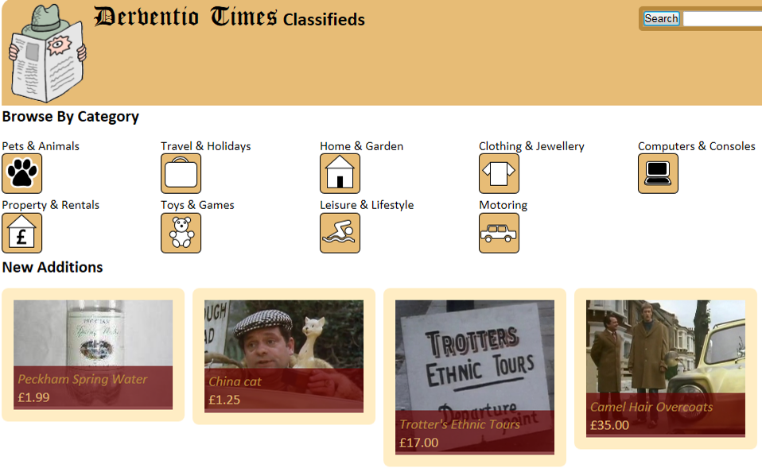

import { FontAwesomeIcon } from '@fortawesome/react-fontawesome'
import { faCamera } from '@fortawesome/free-solid-svg-icons'

This project was part of a web server programming module that taught server-side programming techniques and related subjects such as HTTP, HTML forms, 
N-Tier architecture and database access. A classified adverts web application for an online newspaper was developed to demonstrate all of these 
techniques. The site required the following features:

- Any public user can view all of the advertisements without needing to log on.
- Only subscribed users can place new advertisements.
- A search facility is required.
- Adverts past their expiry date should be automatically deleted.
- An administration facility is required that enables a site administrator to reset passwords, delete users and edit or remove advertisements.

The first task was to design the database, this was done using entity-relationship modelling techniques and normalisation. The database was created 
using MySQL. As this was a reasonably complex application, with a lot of use cases, a lot of thought had to be put into the design. I had noticed 
how complex PHP code can become when it is intertwined within HTML. You end up with a lot of little ‘islands’ of PHP amongst the HTML which is difficult 
to maintain and doesn't enable team working between programmer and designer.

An <abbr title="Model-View-Controller">MVC</abbr> architecture is one way of circumventing this issue. A lot of MVC frameworks are available but I wanted 
to come up with my own design to gain a deeper understanding. I sketched out some use case scenarios to picture how people would interact with the site. This 
then helped me come up with the required pages.

<figcaption>
    <FontAwesomeIcon icon={faCamera} /> Use case scenario for the login part of the application. Maps like this were created for all use case scenarios to 
    aid with the MVC design.
</figcaption>

The final design incorporated a controller class which acts as the first point of contact for the application, directing user input to the relevant 
places. A model class handles database interrogation. Database information is then supplied to a relevant view page by the controller to show the 
information to the user. This approach ensures no overlap of functionality, meaning the business logic can be kept in one place, away from the 
presentation and data. This also has the additional benefit of allowing programmers, designers and database administrators to all work on the 
same project without conflict.

<figcaption>
    <FontAwesomeIcon icon={faCamera} /> Overview of the final MVC design highlighting the separation of concerns between programmer and designer.
</figcaption>

Once this skeleton architecture was in place it became simpler to incorporate all of the features into the site by extending the functions of 
the controller and model classes, and adding the relevant views.

This was a very interesting project as it completed my understanding of web development, particularly HTTP features, HTML forms, N-Tier architecture 
and state management (sessions and cookies). The MVC approach made me understand the importance of looking at the design of a web-site before coding 
can begin. Particularly interesting were the security aspects involved in keeping a site free from attacks. Hidden fields were not used, and 
parameterised queries were utilised to prevent SQL injection attacks. All user input was validated at the client side using JavaScript to prevent 
any un-necessary server work, and output was sanitised to prevent <abbr title="Cross-site scripting">XSS</abbr>.

<figcaption>
    <FontAwesomeIcon icon={faCamera} /> App home page view.
</figcaption>