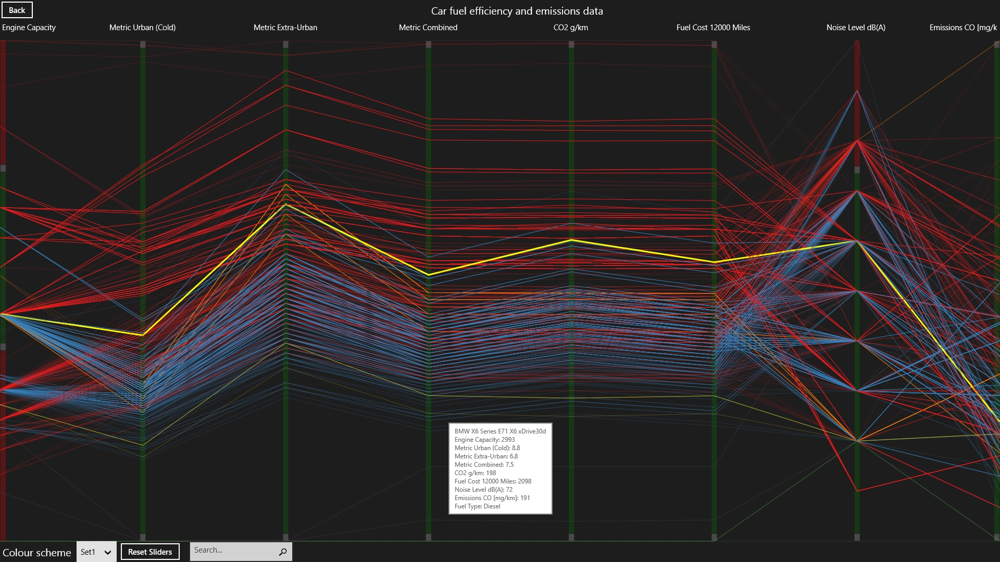

import { FontAwesomeIcon } from '@fortawesome/react-fontawesome'
import { faCamera } from '@fortawesome/free-solid-svg-icons'

This was my final year dissertation project. I was keen to study this area of computing as it became apparent during my studies that data processing 
is one of the most important challenges that lie ahead. Without resorting to hackneyed slogans, data is now being produced at exponential rates 
thanks to huge investment in sensing, simulating, and communication technologies. Couple this with a decrease in storage costs and you end up with 
a situation where our ability to collect data has outstripped our ability to process it. Data visualisation (the graphical representation of data) 
is an important tool which can help redress the balance.

My research uncovered a situation where the disparate disciplines involved in the field of data visualisation were operating in apparent 
isolation. This enables the creation of inaccurate data visualisations, which is surprisingly evident in software. The lack of collaboration 
allows the conventional rules to be broken because ultimately, developers of data visualisation software were not aware of the founding principles.

This results in a ‘gap’ in current work where the wisdom of each discipline needs combining as a whole. Data visualisation user controls were created 
to fill this gap. User controls enable programmers to create visualisations that enforce the accepted wisdom of the field, without them having to be 
experts. This also redresses the balance between the widely available tools that target data visualisation experts who may not have any programming 
experience, and the lack of tools that target the reverse.

The controls implement the research findings through a sample set of visualisation techniques specifically chosen as they are suited to larger datasets 
that are now so common, and they also enable interactivity, which is a vital aspect when trying to make useful data discoveries.

#### Graduated Symbol Maps

Graduated symbol maps encode geographic data through the use of glyphs. A glyph is placed on the map and sized according to certain variables. The 
glyphs can be simple shapes, or more complex depending on the amount of variables.

<figcaption>
    <FontAwesomeIcon icon={faCamera} /> World alcohol consumption using the graduated symbol map user control.
</figcaption>

#### Heatmaps

A heatmap encodes numbers through the use of colour. This results in a grid of the data where each cell represents a value and is coloured based 
on the value. It is really useful to display a general view of large amounts of numerical data.

<figcaption>
    <FontAwesomeIcon icon={faCamera} /> The heatmap user control visualising various statistics of UK higher education institutions.
</figcaption>

#### Parallel Coordinates

Parallel coordinates use parallel axes for each data dimension. Then for each unit of data, a line is drawn from left to right, moving up or 
down depending on the values at each axis.

<figcaption>
    <FontAwesomeIcon icon={faCamera} /> Car fuel efficiency visualised using the parallel coordinates user control.
</figcaption>

#### Treemaps

A treemap visualises data through the use of rectangles. The area of the rectangle is the encoding feature, which can also contain further 
nested rectangles to depict a hierarchy.

<figcaption>
    <FontAwesomeIcon icon={faCamera} /> Treemap user control visualising large software projects by lines of code.
</figcaption>

The Windows runtime (WinRT) was chosen as the target environment, although this is arbitrary as the controls have been built up using standard 
controls that are widely available in other environments. The full dissertation has been published in the 
[university’s online journal](http://computing.derby.ac.uk/ojs/index.php/da/article/view/53). Please feel free to 
[download the controls](https://github.com/Poc275/DataVisUserControls) and use them in your own projects.