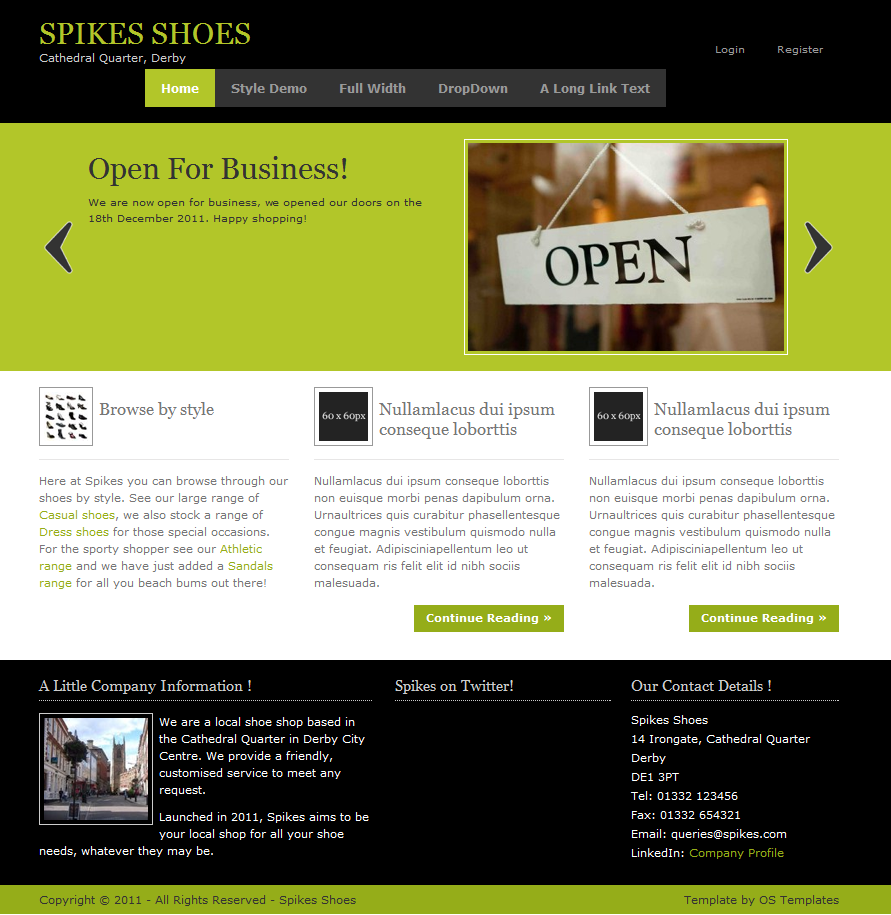

import { FontAwesomeIcon } from '@fortawesome/react-fontawesome'
import { faCamera } from '@fortawesome/free-solid-svg-icons'

The aim of this project was to design a multi-user database system for an online shoe store.

The first step was to identify the entities, relationships and attributes by analysing the project brief. The entities are the things of significance 
about which information needs to be known, such as shoes, customers and orders. Relationships explain how the entities are related (one to one, one to many), 
and the attributes contain specific information about the entities, such as shoe types, gender and payment method. The result of this is a conceptual 
entity relationship diagram, which is a first attempt at modelling the database.

The next step is to break down any many to many relationships as these cannot be represented by a relational database. The conceptual diagram had 
a many to many relationship between ‘order’ and ‘stock’ i.e. each stock item may be bought via one or many order/s, and each order must be issued 
for one or many item/s of stock. A weak entity called ‘order detail’ was created to break this relationship down. Now each order must contain one 
or many order detail/s, and each order detail must relate to only one order (a one to many relationship). Each stock item may be bought via one or 
many order detail/s, and each order detail must order only one stock item (also a one to many relationship). This is depicted in the logical entity 
relationship diagram.

<figcaption>
    <FontAwesomeIcon icon={faCamera} /> The final logical entity relationship diagram. The underlined attributes signify the primary key for the 
    entity i.e. the attribute that uniquely identifies each record. The suffix (fk) refers to a foreign key. This is required to implement the 
    relationships between the entities.
</figcaption>

The normalisation process was next. This is required to minimise data redundancy which causes integrity problems and update/delete transactions 
may not be consistently applied to all copies of the data causing inconsistencies. Normalisation was carried out up to 
[Third Normal Form (3NF)](https://en.wikipedia.org/wiki/Third_normal_form). This helped identify three more entities that were previously missed. A 
data dictionary was then produced to identify all of the data types for the attributes. The model was now in a suitable state for it to be created 
in an actual <abbr title="Database Management System">DBMS</abbr>. MySQL (later migrated to SQL Server) was chosen for this as it is a widely used 
and readily available DBMS. The physical entity relationship model depicts the MySQL database.

<figcaption>
    <FontAwesomeIcon icon={faCamera} /> MySQL physical entity relationship diagram.
</figcaption>

A front end was then created using PHP to test the database. To accomplish this a navigation map was produced by applying use case scenarios to 
the system to identify all of the pages that are required, which tables and attributes are required, whether the page is static or dynamic, public 
or private, and if the page requires read or write permissions on the database. The idea is that a front end developer can pick this up and have an 
immediate overview of how to put the site together. It is also often shown to business managers for approval.

<figcaption>
    <FontAwesomeIcon icon={faCamera} /> Front end navigation map.
</figcaption>

A second version of the system was created using SQL Server and ASP.Net. This combination of open source and proprietary systems provided a 
broad appreciation of the available DBMS that exist in the industry and reinforced the strength of the design as it was easily portable to 
another set of technologies.

<figcaption>
    <FontAwesomeIcon icon={faCamera} /> SQL Server/ASP.Net home page.
</figcaption>