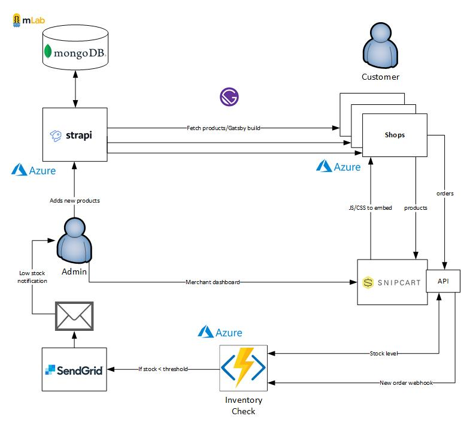

import { FontAwesomeIcon } from '@fortawesome/react-fontawesome'
import { faCamera, faTable, faQuoteLeft } from '@fortawesome/free-solid-svg-icons'

A friend approached me with a requirement to build an online shop for his clothing business. So far, so good. However, he wanted to expand his business into different niche markets which resulted in some strict requirements. Firstly, he wanted to spin up a new online shop on a fairly regular basis once he identified a new niche in the market. Secondly, he wanted to manage this all from a single "warehouse" instead of the pain of managing multiple instances of e-commerce sites with separate stock, orders etc. So far, so not so good. This certainly added a lot of complexity, but it must be possible... right?

His very first site was created using [WooCommerce](https://woocommerce.com/#) which is an open source e-commerce platform built on WordPress. This worked really well for a single site and it was being used without any issues. I decided to stick with the WordPress/WooCommerce approach to prevent any major disruption to his existing setup (changing technologies/moving providers etc.) A single WooCommerce installation does not support multiple shops so the first task was to find a way around this. The [WooCommerce Multistore Plugin](https://woomultistore.com/) enables you to manage multiple WooCommerce shops from a single WordPress administration site, just what we needed. It required some back-end changes such as reinstalling WordPress in [multisite mode](https://wordpress.org/support/article/create-a-network/) and some domain name mapping at the web host to direct visitors to the correct multisite shop. This added complexity and was fairly tricky to setup, including some gotchas such as using multisite in sub-domain, not sub-directory mode as each shop in the network would require its own unique domain name. But it worked, we were able to add shops to the network and manage products and orders from a single WordPress admin panel.

### Mo requirements, mo problems

Problems arose when we tried to implement some of the lower level requirements:

- **Custom product attributes**: Although possible, they proved time-consuming as we had to add these fields in every time a new product was created, and there were many to add. There wasn't a way to create an overall product "blueprint". On multiple occasions we missed attributes because they were typed slightly differently between products or missed out by mistake.
- **Email notifications**: It was a requirement to be notified via email when the stock level for a certain item became low. Again this was possible via WooCommerce but some of the custom attributes were required in the email notification (supplier details for example) which proved difficult to implement.
- **Shop specific invoices**: As the orders were centralised, even though you could see which shop in the network the order had originated from, it wasn't easy to send a custom invoice with that shop's specific information.
- **User accounts**: Ideally users would register at one of the shops and be registered for all shops in the network. We could then build up a customer relationship across the network offering discounts, memberships etc. without having to manage the same user account multiple times. I tried a variety of plugins to solve this without any luck.
- **Consumables as products**: This was a killer of a requirement. Every order is delivered in a custom made box which come in various sizes. The boxes are branded with the shop's logo and are made by a supplier. It was therefore desirable to monitor the stock levels of these to ensure an order could be fulfilled. As such an order had to be automatically placed for a box whenever a customer placed an order, all invisible to the customer. The only way to do this was via [the chained products plugin](https://woocommerce.com/products/chained-products/?aff=10486&cid=1131038) but this would add it to the customer's invoice which was not acceptable.

### The Camel's Back is Broken

It was still possible to continue with this approach by bending some of the requirements (or scrapping them altogether in the case of consumables), but the straw that broke the camel's back was styling. Each shop had to have its own unique look and feel. That's OK I thought, just choose a WooCommerce theme as close as possible to the required style and customise it from there. *Customise it from there*, those words would come back to haunt me. Modifications to layouts, colour schemes, menus etc. proved to be ridiculously tedious. At one point I was modifying the content of a header menu in the WordPress admin panel, positioning it inside the visual theme editor and tweaking its appearance via a plugin which let me write custom CSS. This was an exercise in futility. 

> Fundamentally the UI and back-end are tightly coupled in a WordPress/WooCommerce setup, small changes are OK but anything more substantial opens up a world of pain.

Also by this stage the number of plugins had grown. It felt like the proverbial house of cards ready to tumble at any point. Conflicts were a common occurrence, especially custom CSS/JS being overwritten.

| Plugin                       | Description                                                  |
| ---------------------------- | ------------------------------------------------------------ |
| Wordpress                    | Content management system                                    |
| Wordpress Multisite          | Multisite setup which enables Woo Commerce multistore to work |
| Woo Commerce                 | For e-commerce                                               |
| Woo Commerce Admin           | Admin panel for Woo Commerce                                 |
| Woo Multistore               | Enables multiple shops to work from a single "warehouse"     |
| Yoast SEO                    | Search engine optimisation and marketing                     |
| Astra                        | For shop themes                                              |
| jQuery                       | Adds jQuery functionality                                    |
| Code Snippets                | For adding custom JS/CSS code snippets                       |
| Font Awesome                 | For icons                                                    |
| GDPR Cookie Consent          | GDPR support                                                 |
| PDF Invoices & Packing Slips | Create, print and email PDF invoices and order packing slips |
| WPForms                      | Contact form plugin                                          |
| Akismet Anti-Spam            | Anti spam plugin                                             |
| Gutenberg                    | Page builder plugin                                          |

<figcaption>
    <FontAwesomeIcon icon={faTable} /> Plugin hell.
</figcaption>

Now all of this isn't to say a more talented developer couldn't make this work. I hadn't used PHP for many a year and WordPress/WooCommerce *ain't me specialties*. It reached decision time, either I quit whilst I'm behind and see if we can hand off to a professional WordPress developer, or move on to Plan B.

### Plan B

The main alternative that I could see was to de-couple the back-end "warehouse" and front-end shops. This would enable a separation of concerns allowing a designer to create the shop UIs and a developer to build the warehouse. This is the realm of a **headless CMS**. Unlike WordPress which provides the back-end (database, admin interface), front-end (view layer) and the integration between, a headless CMS removes the front-end view layer, or head, giving you more flexibility in delivery of content. There has been a boom in popularity of headless CMSs recently using languages that I am more familiar with (JavaScript) which made this approach appealing.

#### Headless CMS Selection

The question was then can the original requirements still be met when switching over to a headless CMS approach? There are many headless CMSs out in the wild which were evaluated on a case by case basis.

| CMS                | Yarp                                                         | Narp                                                         |
| ------------------ | ------------------------------------------------------------ | ------------------------------------------------------------ |
| DatoCMS            | Enterprise grade CMS. GraphQL/REST support. Customisable UI. | Cost.                                                        |
| Contentful         | Enterprise grade CMS. GraphQL/REST support. Customisable UI. | Cost. Manual installation.                                   |
| Strapi             | Open source CMS. GraphQL/REST support. Customisable UI.      | Manual installation. Requires separate database.             |
| Headless WordPress | Current setup already in WordPress.                          | PHP skills. [Slow](https://www.smashingmagazine.com/2018/10/headless-wordpress-decoupled/#improving-performance-decoupled-json-approach). |

<figcaption>
    <FontAwesomeIcon icon={faTable} /> Headless CMS Pros and Cons.
</figcaption>

Strapi was chosen as fundamentally this choice came down to cost. With the price of hosting, domain names and the payment gateway all taking a chunk out of the profits, if a free option was available then it should be taken.

#### E-Commerce Selection

The CMS is only part of the solution, a WooCommerce alternative was also required.

| E-Commerce      | Yarp                                                         | Narp                                                         |
| :-------------- | ------------------------------------------------------------ | ------------------------------------------------------------ |
| Stripe Checkout | Easy to setup. Well recognised payment gateway.              | Self-hosted, takes you to Stripe's site for payment. No shopping basket incorporation. Handles stock separately. |
| Snipcart        | Easy to setup. Incorporates into the front-end code. Flexible. | Security concerns. Lack of control over payment process and appearance. |
| Shopify         | Well established e-commerce platform. Can handle CMS requirements as well as payments. | Cost.                                                        |
| WooCommerce API | Can keep current warehouse setup.                            | Not fully supported. No order endpoints. No user account support. Have to manage payment manually. |

<figcaption>
    <FontAwesomeIcon icon={faTable} /> E-Commerce Pros and Cons.
</figcaption>

I first tried Stripe checkout. It was very easy to setup and nice to work with but unfortunately it didn't meet our specific requirements. It forces you to leave the shop site to place an order, there is no shopping basket incorporation and there is no easy way of integrating the CMS which means stock has to be entered again in the Stripe admin dashboard. It just wasn't quite what we needed but Stripe Checkout is still an excellent choice if you only have a single shop with a small inventory and don't mind customers being navigated away from your site.

Shopify was discounted for cost reasons and the WooCommerce API idea was canned for obvious reasons. This left Snipcart. This was a curious option as it actually embeds in the front-end HTML as a "drop-in" shopping cart for existing sites. This made it easy to setup but I was concerned about security. What prevents someone modifying the HTML to change the price of a product for example? You add your shop URLs to a whitelist which Snipcart then crawls to find the products (via the use of custom `data-` attributes). A merchant dashboard is then populated allowing you to manage the inventory. This is then checked when an order is placed to ensure the information matches, if it doesn't the order cannot be submitted. This appeased any security concerns I had. By embedding in the HTML it also made it easy to link up to the CMS. The product data could be retrieved from the CMS API and the Snipcart HTML attributes added to the markup, thus linking the two. This ensured that there was no duplication of data entry anywhere in the system. The only slight caveat to note is that Snipcart controls the inventory levels whereas Strapi controls all other product details. This is adding complexity as it means product details are split across different systems but this seemed a small price to pay to meet the requirements.

#### Front-end Selection

This left choosing a front-end technology to create the actual shop sites.

| Front-end           | Yarp                                                         | Narp                                              |
| ------------------- | ------------------------------------------------------------ | ------------------------------------------------- |
| Vanilla HTML/CSS/JS | Less complex. Easy Snipcart integration.                     | Integration with Strapi.                          |
| React               | Can create a more feature rich UI.                           | Adds complexity.                                  |
| Gatsby              | Static site means faster load times. PWA to improve SEO and drive an increase in conversion rates. Strapi and Snipcart plugins available. | Requires a build every time a CMS update is made. |

<figcaption>
    <FontAwesomeIcon icon={faTable} /> Front-end Pros and Cons.
</figcaption>

In the end, surprisingly, I chose Gatsby. I don't think this is a common usage scenario for Gatsby but it was mainly for speed and SEO reasons. Studies have shown that page load times are a massive factor in conversion rates and a static site is going to give you this benefit as well as utilising React to create a more engaging UI. It was the best of the both worlds. The only apprehension I had was that a build is required each time a CMS change is made, but there are continuous deployment options available so I wasn't overly concerned that this was an insurmountable problem. Foolhardy you may say but time will tell.

#### Requirements Revisited

So after all of this did we now meet the original requirements?

- **Manage multiple shops from a single place**: Yarp. Adding the new shop URL to your Snipcart whitelist makes it available to take orders from your merchant account. A custom field was then added in Strapi to define which shops a product should be placed into. The Gatsby Strapi plugin then filters on this field to only return the correct products for that specific shop.
- **Custom product attributes**: Yarp. Strapi enabled a product "blueprint" to be created with full control over the fields and types it contains.
- **Email notifications**: Yarp. This was achieved via [Snipcart webhooks](https://docs.snipcart.com/v3/webhooks/introduction). By hooking into the new order event a call is then made to the Snipcart API to check the inventory level and an email sent if below a certain threshold. A low threshold field was added to Strapi which enables us to have different thresholds per product as some will sell more quickly than others.
- **Shop specific invoices**: Yarp and narp. Via Snipcart's [custom order fields](https://docs.snipcart.com/v3/setup/order-custom-fields) we were able to inject the shop name into the order which enabled us to find out which shop the order originated from. Snipcart uses templating for invoices which meant we could override the default invoice and add this information in. The only requirement we couldn't meet was for a custom order prefix per shop but this wasn't a deal breaker.
- **User accounts**: Yarp. Snipcart manages user registration as part of the checkout process. We can also enable guest only which means customers can still place an order without having to register. As they are registered through Snipcart we can manage them across the different shops. Gatsby also has a [Snipcart plugin](https://www.npmjs.com/package/gatsby-plugin-snipcart-advanced) which makes retrieving logged in user details simple.
- **Consumables as products**: Yarp, although not implemented yet. Again through the use of webhooks. The new order event can be hooked into and a call made to Strapi to check which box is required for this product. A Snipcart order can then be generated for this box which can be picked up during fulfilment and reduce the inventory level as required.
- **Styling**: Yarp. By decoupling the front and back-ends we now have full control over the shop site's code. No more managing themes via an admin panel.

### Final Architecture

<figcaption>
    <FontAwesomeIcon icon={faCamera} /> The final architecture diagram.
</figcaption>

The Strapi CMS site was deployed to Azure and it uses a MongoDB database ([as recommended](https://strapi.io/documentation/v3.x/guides/databases.html)) hosted for free on mLab. The warehouse admin can then visit the CMS site and add/modify products. This (eventually) will kick off a Gatsby build where the [Gatsby Strapi source plugin](https://github.com/strapi/gatsby-source-strapi) fetches the products (filtered by shop id) and builds the product pages. Part of this is adding the Snipcart HTML attributes which enables them to be crawled. The admin then logs into the Snipcart merchant dashboard and fetches the products via their URLs. This isn't mandatory but it adds them to the dashboard enabling the inventory levels to be set. Customers can still order a product that hasn't been fetched, but fetching enables us to set stock levels up front.

For low stock notifications (and eventually, consumables) the new order webhook event is attached to in an Azure Function. This gets notified every time there is a new order and calls the Snipcart API to retrieve the inventory level. If it is below the threshold then an email notification is sent. Azure Functions seemed to me to be a natural fit for consuming webhooks. It is something that is easily triggered, you don't have to manage infrastructure meaning you can concentrate on the logic and you only pay when it runs, keeping costs down to a minimum. SendGrid is used to send email notifications. Their JavaScript SDK made it easy to incorporate into the Azure Function and as we are not expecting a huge amount of emails to be sent, it should fit within their free tier offering again keeping costs down.

### Rip It Up and Start Again

As a developer it always seems tempting to rip it up and start again. I've inherited enough code bases from hell to have dreamed about this often. However, the majority of the time things developed the way they did for good reason, and starting over again, no matter how attractive ("if I just use *x* all my problems will be over" 😂), will still lead to the same issues. This is one of the few times I've found an exception to this rule. I feel the switch was justified and we are now seeing the fruits of this labour take hold as we can turn around UI changes a lot more quickly and easily. This has been a serious journey over many years so it wasn't an easy decision to make. A lot of effort and money was put into getting the WordPress/WooCommerce setup ready but in the end the requirements just couldn't be met. It was only the recent advancement of headless CMSs that meant we could attempt this new approach, otherwise we would have had to scrap some of the original requirements and had to stick with WordPress/WooCommerce. This would have been a real shame as a lot of time and effort has been put into the planning of the business and the e-commerce requirements were obviously a vital ingredient.

Excitingly we are almost ready to go live with the first shop! You can play around with a [demo here](https://snipcart-demo-shop.netlify.app/).