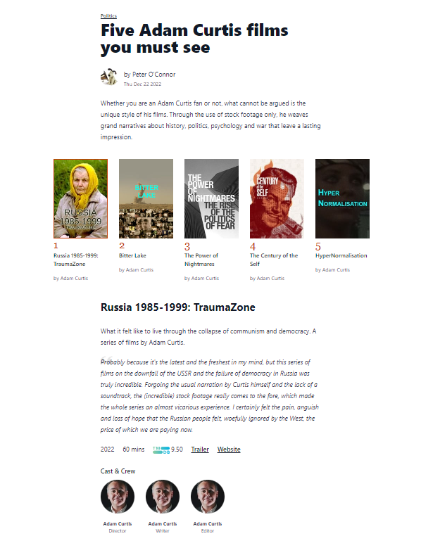
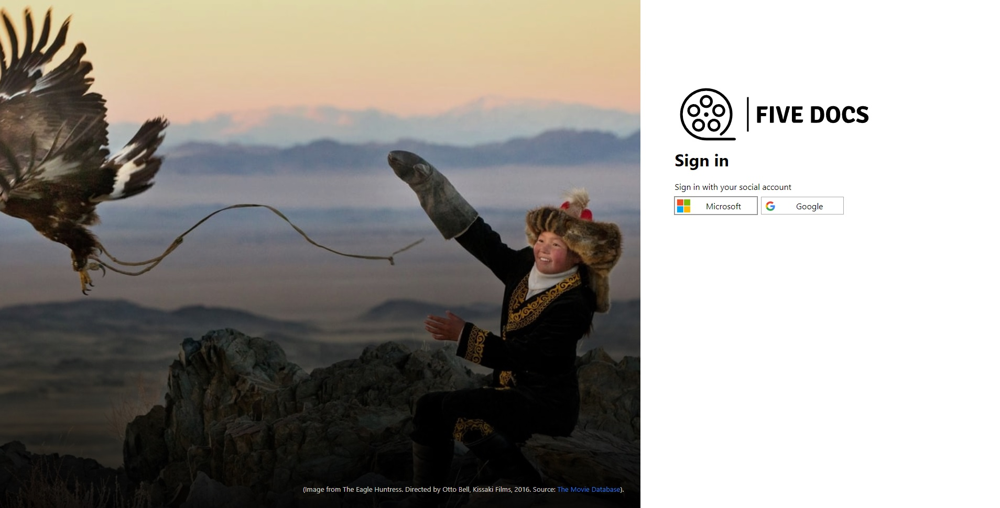
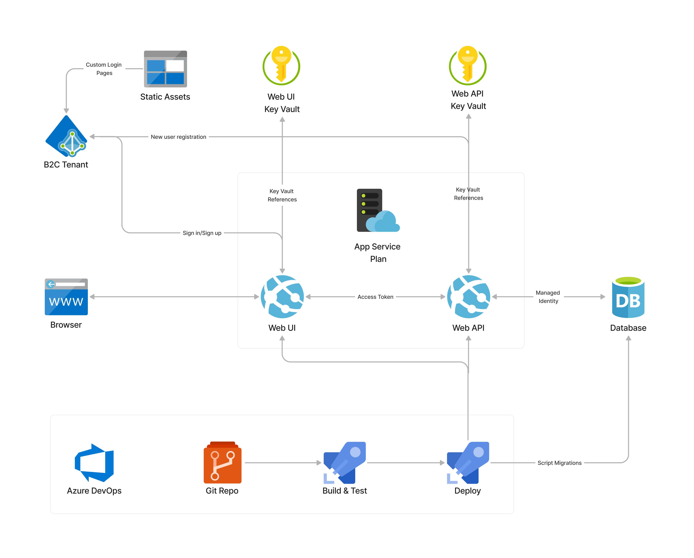

import { FontAwesomeIcon } from '@fortawesome/react-fontawesome'
import { faCamera, faVideo } from '@fortawesome/free-solid-svg-icons'


I’ve been learning a lot of cloud technologies (Azure) and developing my DevOps skills over these last few years. This has involved the usual courses, 
tutorials, articles and tinkering with code, which are great, but you always feel like you are only looking at a small subset of the bigger picture. What 
I’ve always wanted to do is to create some sort of application that brings all of these parts together to really drive home the concepts and test my knowledge.

I came up with an idea for a simple web app called Five Docs. This stems from my love of documentaries (I do love a good doc) and is a really simple app that 
lets users create lists of five documentaries on any subject whatsoever. It’s a simple idea, but has enough moving parts for me to stretch myself in the 
areas I’ve been trying to learn, such as:

- Full stack development
- Database development
- Integrating with 3rd party APIs
- Authentication and Authorisation
- Cloud native development techniques
- DevOps

It’s also open-ended enough for me to take as far as I want, which could include future features such as monitoring and telemetry, incorporating 
messaging/events for list ratings/likes, caching and CDNs for performance and app configuration to manage settings and feature flags.

### Development

The API is a Dotnet Core Web API project written in C#. Nothing controversial here, it’s a well-supported framework which is easy to deploy to the cloud.

For the UI I decided to go with something a little bit different, [Remix](https://remix.run/). I’ve been following Remix for a while now and have really 
liked what I’ve seen. It’s a full stack framework based on React Router. It is heavily focused on web standards such as the 
[Fetch API](https://developer.mozilla.org/en-US/docs/Web/API/Fetch_API), which means you don’t have to learn a whole new framework paradigm. It’s also 
aimed towards distributed environments in the cloud to provide better performance, which made it a compelling choice. Plus, it’s still a React framework, 
so no need to throw away all that React knowledge.

I’ve been mainly creating Single Page Apps (SPAs) and static generated sites (SSGs) recently (this site is a static site for example), so this was my 
first foray into the server-side rendering world. Being route-based, Remix route modules contain both the UI and server-side interactions (via 
[actions](https://remix.run/docs/en/v1/route/action) for `POST`, `PUT`, `DELETE` and [loaders](https://remix.run/docs/en/v1/route/loader) for `GET`) in the 
same file. This may take some getting used to realise what code is running where (and where your 
console logging is going 😊) but once you get used to it, it’s actually a really nice pattern as it meant I wasn’t trawling through components and 
controllers looking for things, the view and controller are in the same file. Also being able to nest routes means that Remix will load data in parallel 
for all matching routes for better performance, so say goodbye to those request waterfalls!

I really enjoyed Remix embracing web standards. The Fetch API and the humble `<form>` get a lot of love in Remix meaning that I didn’t have to learn 
any new framework paradigms and was able to build on (and even expand) my knowledge of web standards. It almost felt like web development back in the day 
with simple forms and actions before the world got way more complex.

I was also keen to make use of the server-side to take as much load from the front end as possible. Developing SPAs and SSGs over the last few years I was 
acutely aware of some of the issues those approaches have, such as:

- Larger network payloads e.g. large JavaScript bundles, no server to prune data sent back to the client
- More than likely slower than the server due to extra time needed for loading and rendering
- Accessibility and search engine optimisation
- Keeping tokens and secrets away from the browser

This ended up leading to a [backend for frontend](https://www.thoughtworks.com/en-gb/radar/techniques/bff-backend-for-frontends) approach, where the backend 
code connects to the API to serve the data. This way I was able to prune the data sent over to the frontend, do all of the data wrangling and external API 
calls and keep keys/secrets away from the browser for extra security. It was definitely overkill, backend for frontend is probably more suited to apps which 
have a lot of pre-existing backend code that cannot be migrated, so I could certainly have done away with the extra API layer. But for a learning exercise 
I wanted to have that extra API application to cement my knowledge.

### Database

For the database I chose a traditional relational database, SQL Server. The application doesn’t require too much data to be stored (lists, documentaries 
and users) so a relational model suited this fine. It also fits easily into the Dotnet Core Web API via Entity Framework Core.

### Third Party APIs

For documentary information I integrated with a [3rd party API provided by The Movie Database](https://developers.themoviedb.org/3). This enabled me to 
store just the id of a documentary in my database, and reach out to the 3rd party API to fetch extra details for the UI.


<figcaption>
    <FontAwesomeIcon icon={faCamera} /> Example of a Five Docs list enhanced with information from the TMDB API.
</figcaption>

### Authentication and Authorisation

Although being a simple app, I could still incorporate authentication and authorisation in terms of letting anyone view the lists, but restricting 
the creation of new lists to registered users only.

It obviously made sense to leverage [Azure Active Directory (AAD)](https://azure.microsoft.com/en-us/products/active-directory) here, and there are a few options 
available in this space such as [Easy Auth](https://learn.microsoft.com/en-us/azure/app-service/overview-authentication-authorization) or AAD itself, but I 
decided to go with [AAD B2C](https://azure.microsoft.com/en-gb/services/active-directory/external-identities/b2c/#overview) as it is more focused towards 
customer-facing apps than traditional AAD, and gives you the chance to customise the whole identity and access management for your app which Easy Auth 
doesn’t provide.

I didn’t want to manage user accounts/passwords and the headaches that brings, so I decided to only allow social media accounts which Azure B2C makes very 
easy to wire up. The app uses the [MSAL library](https://learn.microsoft.com/en-us/azure/active-directory/develop/msal-overview) (for Node.js in this case) to 
incorporate authentication/authorisation. Once authenticated a session cookie is stored (hello again web standards) and the backend for frontend approach 
made it much easier to secure things like client secrets. For authorisation you can then check for the existence of a session cookie and redirect if it 
isn’t found, which guards the routes accordingly.


<figcaption>
    <FontAwesomeIcon icon={faCamera} /> Azure B2C lets you customise the whole identity experience, such as the login page.
</figcaption>

The only gotcha I had here was incorporating MSAL into Remix. When trying to get a refresh token I was noticing that the token cache that MSAL maintains 
was coming back empty, even after a user had just authenticated. The issue was that [in development, Remix will purge the cache for every request to provide 
a “live reload” development experience](https://remix.run/docs/en/v1/other-api/serve), which resulted in a new MSAL instance being created (with an empty 
token cache). The fix was to add the MSAL instance to a global variable (for development only, in production this isn’t an issue):

```javascript
let cca;
if (process.env.NODE_ENV !== "production") {
    if (!global.cca) {
        global.cca = new msal.ConfidentialClientApplication(clientConfig);
    }

    cca = global.cca;

} else {
    // not an issue in prod so can just return a new instance
    cca = new msal.ConfidentialClientApplication(clientConfig);
}

export { cca };
```

### Cloud native development

The creation of the app really helped drive home some cloud-first development techniques that I had learned about in isolation, but hadn’t yet had the 
chance to use in anger.

#### Managed Identities & Key Vault References

I was able to utilise managed identities for additional security, particularly for the Web API access to the database 
([which I’ve written about before](https://dev.to/poc275/connecting-to-azure-sql-using-managed-identity-3cji)) and for access to secrets stored in 
[Key Vault](https://azure.microsoft.com/en-us/products/key-vault/). Key vault secrets were surfaced to the app’s settings via 
[Key Vault References](https://learn.microsoft.com/en-us/azure/app-service/app-service-key-vault-references?tabs=azure-cli).

This helped remove the need to manage any credentials, so no chance of leaking any sensitive information in source code, connection strings or any chance 
of them reaching the browser. RBAC role assignments also meant that apps’ permissions could be constrained to the bare minimum.

### DevOps

I wanted to underpin the entire app with the DevOps principles that I’ve learned over the last 12 months. Many tutorials and articles aimed at 
developers will not include a section on deployment, or if they do, they will try and simplify it e.g. 
[one click deployments](https://learn.microsoft.com/en-us/azure/azure-resource-manager/templates/deploy-to-azure-button), 
[Visual Studio deployments](https://learn.microsoft.com/en-us/visualstudio/deployment/quickstart-deploy-aspnet-web-app?view=vs-2022&tabs=azure) etc. which 
are great for learning, but do not really fit into a DevOps approach, so this was a vital piece of the puzzle for me in getting that end-to-end understanding.

I used Azure DevOps as the Application Lifecycle Management (ALM) tool and made use of git for source control, as well as build and release pipelines 
to automate builds, testing and deployments.

I also used Infrastructure-as-Code (IaC) pipelines and Azure Resource Manager (ARM) templates to deploy the infrastructure. This meant I was able to 
deploy changes to the infrastructure in a controlled way (all managed in the source code) and the templated deployments meant it could easily be torn 
down and created again for another environment e.g. staging/testing/production.

One of the trickier parts to deployment was the deployment of database updates. Entity Framework (EF) makes this a lot easier, but EF migrations applied 
directly to the database do not fit into a DevOps approach and are not really suitable for a production scenario where any data changes need to be tested 
beforehand to prevent any data loss. Therefore, I decided to use a scripted migration approach where a migration SQL script is generated instead of 
migrations being applied directly. The generated script was then run against the database as part of the deployment pipeline to update the database (and in a 
real-world scenario, could have been guarded with a manual check by a DBA).

This DevOps work really helped bring on my pipeline knowledge (including the use of YAML to author them), experience with ARM templates (this was the 
first time I’d used them in anger), as well as PowerShell knowledge which is the glue that holds it all together.

### Architecture


<figcaption>
    <FontAwesomeIcon icon={faCamera} /> Architectural overview.
</figcaption>

Architecturally, the app is relatively straightforward. We have two App Services under a single App Service Plan, one for the UI and another for the API. The 
API connects to an Azure SQL database using managed identity as mentioned. Each App Service has its own Key Vault which surfaces app settings via Key Vault 
References. The B2C tenant handles authentication, returning an ID token and an access token for the API once authenticated. When a new user registers, a 
[B2C API connector](https://learn.microsoft.com/en-us/azure/active-directory-b2c/api-connectors-overview?pivots=b2c-user-flow) is used to call the API app 
so the new user can be inserted into the database. A storage account is used for the B2C static assets e.g. custom branding, login page etc.

All of this is underpinned by a DevOps approach using Azure DevOps. The source code is stored in a git repo, and any push to the main branch triggers the 
relevant pipelines to build, test and deploy the applications. Another pipeline is used to handle database migrations, using the scripted approach mentioned 
previously.


### Beta version is live

This has been a great learning experience, and I’ve really enjoyed getting to grips on a full stack application again. Keeping the app’s features down 
to a bare minimum was key as it kept me from straying too far from the original goal of applying my cloud/DevOps skills in a real app scenario. I don’t 
really plan on taking the application further in terms of promoting it for real use in the wide world, it really was just for learning purposes. But a 
[beta version is now live](https://fivedocs.azurewebsites.net/) if you’d like to try it out, and if you like it, even better!
