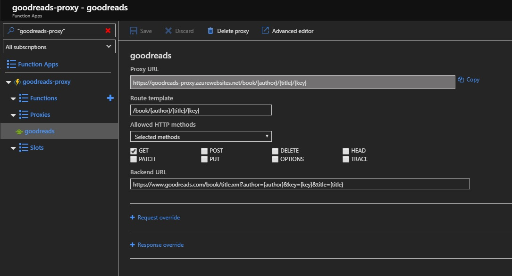
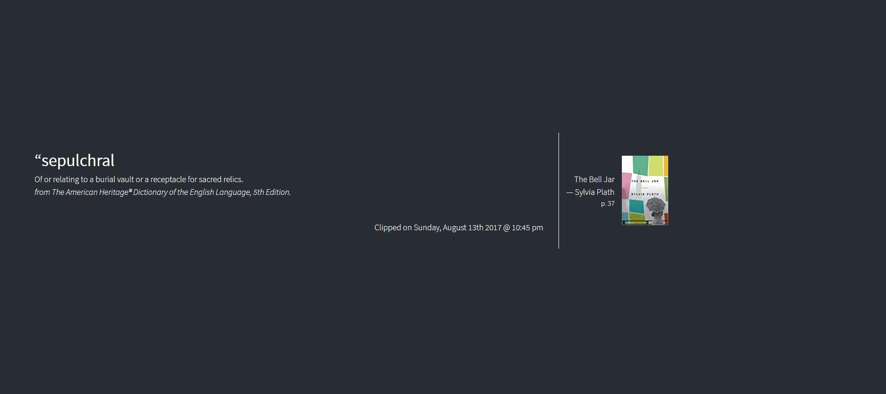

import { FontAwesomeIcon } from '@fortawesome/react-fontawesome'
import { faCamera } from '@fortawesome/free-solid-svg-icons'

I love to read, and if I’m reading on my Kindle then I like to highlight my favourite passages and words to create a collection of interesting 
information for future reference. Unfortunately, the Kindle ecosystem is quite limited on what you can do with these ‘clippings’. You can view 
them on the Kindle cloud reader app, and I’ve used the Clippings.io web app which enables me to organise and tag them. However, I wanted a 
bit more functionality such as the ability to look up word definitions, retrieve book information and an improved UX as I wasn’t too enamoured with 
the infinite scrolling UI.

I came across the excellent [Amanuensis project](https://notapattern.net/2016/03/10/amanuensis-automating-kindle-highlights/) which had very similar 
aims. The key idea behind this, and the part I was missing, was to export from Clippings.io and import them into Airtable. This finally gets them 
into a place you can access via an API.

I was then able to create a simple React app to read from the Airtable API. Word definitions are provided via the [Wordnik API](https://www.wordnik.com/). This is a great 
resource and as a non-profit organisation it is well worth the $5 to get an API key and support the project at the same time.

Book information is provided by the [Goodreads API](https://www.goodreads.com/api). Surprisingly, the API doesn’t support <abbr title="Cross Origin Resource Sharing">CORS</abbr>, 
so any requests initiated from a script will be denied (i.e. the API doesn’t send an `Access-Control-Allow-Origin` 
header in the response). To get around this I needed a proxy to take the request from the script and forward it to the API. There are some funky workarounds that 
I’ve seen to do this such as using [YQL](https://yuilibrary.com/yui/docs/yql/) (now retired) but since I have access to Azure, I decided the easiest option was to 
create an Azure Function App. Function Apps have a proxy option which can be set to forward requests to any other resource.

<figcaption>
    <FontAwesomeIcon icon={faCamera} /> Azure Function Proxy Setup. Remember to use curly braces to reference request parameters.
</figcaption>

Then it’s a simply a case of calling the Function App’s endpoint and the book information is retrieved.

<figcaption>
    <FontAwesomeIcon icon={faCamera} /> Example of a word definition clipping.
</figcaption>

At this current stage I’m just displaying a random clipping, the book information, and a definition if the clipping is a single word. Future features 
include arranging the clippings by book, navigation buttons to get the next clipping or a random clipping, retrieve more detailed book/definition information and some <abbr title="Natural Language Processing">NLP</abbr>
to retrieve sentiment and keywords to do automatic tagging. The [live app is available now hosted on Netlify](https://kindle-clippings.netlify.com/).