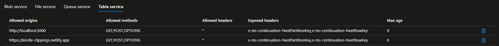

import { FontAwesomeIcon } from '@fortawesome/react-fontawesome'
import { faCamera } from '@fortawesome/free-solid-svg-icons'

[Updated 3rd August 2024](#update)

I love to read, and if I’m reading on my Kindle then I like to highlight my favourite passages and words to create a collection of interesting 
information for future reference. Unfortunately, the Kindle ecosystem is quite limited on what you can do with these ‘clippings’. You can view 
them on the Kindle cloud reader app, and I’ve used the Clippings.io web app which enables me to organise and tag them. However, I wanted a 
bit more functionality such as the ability to look up word definitions, retrieve book information and an improved UX as I wasn’t too enamoured with 
the infinite scrolling UI.

I came across the excellent [Amanuensis project](https://web.archive.org/web/20210623202921/https://notapattern.net/2016/03/10/amanuensis-automating-kindle-highlights/) which had very similar 
aims. The key idea behind this, and the part I was missing, was to export from Clippings.io and import them into Airtable. This finally gets them 
into a place you can access via an API.

I was then able to create a simple React app to read from the Airtable API. Word definitions are provided via the [Wordnik API](https://www.wordnik.com/). This is a great 
resource and as a non-profit organisation it is well worth the $5 to get an API key and support the project at the same time.

Book information is provided by the [Goodreads API](https://www.goodreads.com/api). Surprisingly, the API doesn’t support <abbr title="Cross Origin Resource Sharing">CORS</abbr>, 
so any requests initiated from a script will be denied (i.e. the API doesn’t send an `Access-Control-Allow-Origin` 
header in the response). To get around this I needed a proxy to take the request from the script and forward it to the API. There are some funky workarounds that 
I’ve seen to do this such as using [YQL](https://yuilibrary.com/yui/docs/yql/) (now retired) but since I have access to Azure, I decided the easiest option was to 
create an Azure Function App. Function Apps have a proxy option which can be set to forward requests to any other resource.


<figcaption>
    <FontAwesomeIcon icon={faCamera} /> Azure Function Proxy Setup. Remember to use curly braces to reference request parameters.
</figcaption>

Then it’s a simply a case of calling the Function App’s endpoint and the book information is retrieved.


<figcaption>
    <FontAwesomeIcon icon={faCamera} /> Example of a word definition clipping.
</figcaption>

At this current stage I’m just displaying a random clipping, the book information, and a definition if the clipping is a single word. Future features 
include arranging the clippings by book, navigation buttons to get the next clipping or a random clipping, retrieve more detailed book/definition information and some <abbr title="Natural Language Processing">NLP</abbr>
to retrieve sentiment and keywords to do automatic tagging. The [live app is available now hosted on Netlify](https://kindle-clippings.netlify.app).

## Azure Table Storage 🆙
<a name="update"></a>

The backend data store has now been migrated from Airtable to Azure Table Storage due to changes in Airtable's free tier offering.

Azure Table Storage is a simple NoSQL data store. It is a key/value type of NoSQL data store, with a key comprising of two properties - a partition key, which groups 
together related rows to aid in load balancing and query speed, and a row key, which is a unique identifier for a row in a given partition. This made it a good fit for the 
data as it is structured in so much as it has a *schema* (a set of column headings), but it is just a single list of clippings, so isn't relational. The Goodreads book ID was a good 
candidate for the partition key, and a unique ID was generated for the row key.

The schemaless approach is beneficial in terms of giving you the flexibility to evolve the data structure as you develop. So no up-front database 
design/<abbr title="Entity-relationship modelling">ERM</abbr> is required to get started. Table Storage is also built on top of Azure Storage Accounts, meaning it can 
store huge amounts of data, is available over the web, and being a lot cheaper than a traditional SQL database, made it an ideal choice for this project. Although inevitably 
there were a couple of gotchas.

### Authorisation

Use managed identities! That is the moral of the tale that is to follow. But in my haste, and foolishly thinking that using 
[the storage account key](https://learn.microsoft.com/en-us/rest/api/storageservices/authorize-with-shared-key) would be quicker 
and easier, I went down the key route. As this was just a demo project, mainly for personal consumption, I considered this a valid approach, although for 
production I would definitely use managed identities.

Storage account key authorisation isn't *that* bad, it can just be fiddly in terms of having to generate the authorisation header that you pass in the API request, which consists of these steps:

1. [**Construct the signature string**](https://learn.microsoft.com/en-us/rest/api/storageservices/authorize-with-shared-key#constructing-the-signature-string): This depends 
on the service (Blobs, Files, Queues or Tables) and version you are targeting. For Table Storage there are two options: 
Shared Key and [Shared Key Lite](https://learn.microsoft.com/en-us/rest/api/storageservices/authorize-with-shared-key#table-service-shared-key-lite-authorization). This 
just defines which properties the signature string consists of. As the lite version requires fewer properties, I chose this. It only requires two properties, the date 
and the [`CanonicalizedResource`](https://learn.microsoft.com/en-us/rest/api/storageservices/authorize-with-shared-key#shared-key-lite-and-table-service-format-for-2009-09-19-and-later):

- The date is fairly straight-forward although it must be [formatted exactly as expected (as UTC)](https://learn.microsoft.com/en-us/rest/api/storageservices/authorize-with-shared-key#specifying-the-date-header).
- The `CanonicalizedResource` represents the resource you are targeting, which for Table Storage consists of `/<account name>/<uri path>?<query string>`. In my case I was 
targeting the `clippings` entity, which has this URI: `https://<account name>.table.core.windows.net/clippings()`, which equates to `/<account name>/clippings()` 
as the `CanonicalizedResource`.

2. [**Sign the signature string**](https://learn.microsoft.com/en-us/rest/api/storageservices/authorize-with-shared-key#encoding-the-signature): This can be fiddly to get right. 
You have to encode the signature string using the HMAC-SHA256 algorithm and sign it with your storage account key, which **must be base-64 decoded**. The result **must be 
base-64 encoded** before passing it in the authorisation header. An example JavaScript function implementing steps 1 & 2 is shown below:

```javascript
const generateSignature = () => {
    const date = new Date().toUTCString();
    const canonicalizedResource = "/<account name>/clippings()";
    const stringToSign = `${date}\n${canonicalizedResource}`;
    const key = "<your storage account key>";
    const hash = CryptoJS.HmacSHA256(stringToSign, CryptoJS.enc.Base64.parse(key));
    const signature = hash.toString(CryptoJS.enc.Base64);

    return signature;
}
```

3. [**Specify the Authorization header**](https://learn.microsoft.com/en-us/rest/api/storageservices/authorize-with-shared-key#specifying-the-authorization-header): This is 
simply a case of passing the signature from step 2 in the `Authorization` header of your API call, which must be formatted as follows: 
`[SharedKey|SharedKeyLite] <Account Name>:<Signature>`. Using the [JavaScript Fetch API](https://developer.mozilla.org/en-US/docs/Web/API/Fetch_API/Using_Fetch) it looks like this 
(note you must always pass date and version headers):

```javascript
fetch("https://<account name>.table.core.windows.net/clippings()", {
    method: "GET",
    headers: {
        'Authorization': `SharedKeyLite <account name>:${signature}`,
        'x-ms-version': '2021-04-10',
        'x-ms-date': new Date().toUTCString(),
        'Accept': 'application/json;odata=nometadata'
    }
})
```

As you can see it isn't *that* bad, but takes a bit of work to get things in place as expected; formatting, encoding, hashing and signing in just the right order. It took quite a bit 
of back-and-forth before getting it working. Did I mention I should have used managed identities instead?!

### Query Strings

A small gotcha is in the case of 
[query strings when calling the Table Storage API](https://learn.microsoft.com/en-us/rest/api/storageservices/querying-tables-and-entities#query-string-encoding). They 
must be encoded and if they contain a single quote, they must be escaped by another single quote e.g. `o'clock` becomes `o''clock`.

### Pagination

If a query returns more than 1,000 items, or executes for longer than five seconds, or crosses the partition boundary, the [response will include continuation tokens in the 
header](https://learn.microsoft.com/en-us/rest/api/storageservices/query-timeout-and-pagination) for you to use in subsequent requests to get the next set of results.

This is simply a case of checking the response for `x-ms-continuation-NextPartitionKey` and `x-ms-continuation-NextRowKey` headers, and if present sending another request with 
those values set in the query string e.g. `https://<account name>.table.core.windows.net/clippings()?NextPartitionKey=${nextPartitionKey}&NextRowKey=${nextRowKey}`. However, there 
is a gotcha in cases where you are making a CORS request, which was the case here.

I was trying to parse the response headers via `res.headers.get('x-ms-continuation-NextPartitionKey')` but they were coming back as null. When making a CORS request, 
[only certain headers can be accessed for security reasons](https://web.dev/articles/introduction-to-fetch#response-types). The only headers you can access in these cases 
are the standard ones such as `Content-Type`, `Last-Modified`, `Expires` etc. hence the reason the continuation tokens were null. This is not a client-side issue, but a 
server-side restriction to prevent giving a client too much information which could be used in potential exploits. So you need control over the server to be able to 
explicitly send additional headers in CORS requests, which we can do via the Storage Account CORS settings:


<figcaption>
    <FontAwesomeIcon icon={faCamera} /> Storage account CORS settings to expose the Table storage continuation tokens.
</figcaption>