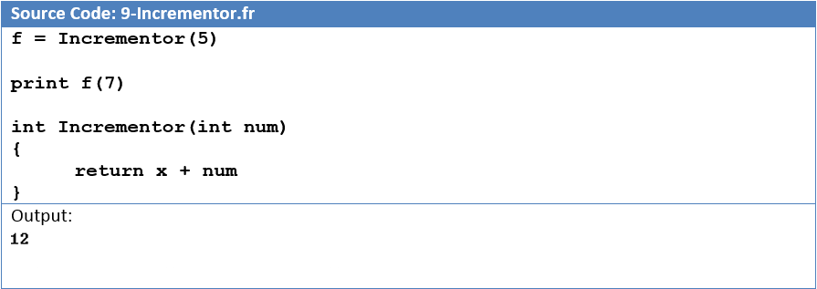

import { FontAwesomeIcon } from '@fortawesome/react-fontawesome'
import { faCamera } from '@fortawesome/free-solid-svg-icons'

### Design

Frooble is an imperative language with functional programming features. It is a high level, verbose, general programming language that aims to 
be easy to learn. Syntactically and semantically it is very similar to Java and C#.

#### Frooble Hello World

```
print "Hello, World!
```

All basic data types are supported: integers, floats, strings, bools and arrays. Object orientation is supported with class based inheritance:


<figcaption>
    <FontAwesomeIcon icon={faCamera} /> A Frooble program demonstrating the object orientation and inheritance capabilities.
</figcaption>

Static scoping is supported allowing local and global variables. Control flow is provided by while loops and for loops. Decisions are supported 
through if/else statements. Code reuse is allowed via functions, which also return values. Frooble programs are read ahead so functions can be 
called before they are defined, C like prototypes are therefore not required. Functions can also be stored as variables and executed later as 
per first-order functions, which is common in the functional programming paradigm:


<figcaption>
    <FontAwesomeIcon icon={faCamera} /> Functional programming in Frooble. The identifier x is retrieved from the parameter list provided to f. Incrementor is 
    a function that ‘adds 5 to something’.
</figcaption>


<figcaption>
    <FontAwesomeIcon icon={faCamera} /> Recursion: See Recursion 🙄
</figcaption>

I wanted Frooble to be able to communicate easily with the outside world, any useful programming language does not exist in isolation. Frooble 
can communicate with C/C++ through the <abbr title="Java Native Interface">JNI</abbr>, allowing easy access to an already available standard library. Frooble 
can export symbols for use in other languages, for example the Python interpreter can be embedded, or a C program can read exported Frooble symbols. This is achieved via 
memory mapped files, so any language with support for reading file mappings can integrate with Frooble. A web data type is also available for 
consuming web APIs. This data type takes a URL that returns JSON data. This data is then bound to a Frooble class which can be easily accessed 
to retrieve the data. The aim of this data type was to abstract out a lot of the hard work involved in consuming web APIs:

```
string city = "Derby"
web weather = "http://api.openweathermap.org/data/2.5/weather?q=" + city + ",uk&units=metric"
print "The weather in " + city + " is " + weather.description + " with a temperature of " + weather.temp + " degrees celsius"
```

### Implementation

The actual implementation is an interpreter written in Java using the [ANTLR](https://www.antlr.org/) parser generator. ANTLR removes a lot of the hard work 
involved in parsing source code, leaving a nice syntax tree to work with. For appreciation a small part of the language was implemented as a compiler 
targeting the virtual architecture [LLVM](https://llvm.org/).


<figcaption>
    <FontAwesomeIcon icon={faCamera} /> ANTLR grammar tree for a Frooble method declaration. Once the source code is parsed into a tree it can be walked 
    to interpret the instructions. The instructions can be implemented in any other language, usually a lower level language such as machine code, but 
    in this case Java is used for simplicity.
</figcaption>

This project, although a challenge, was very rewarding. It completed a lot of gaps in my knowledge in terms of how programming languages have evolved 
and why there are so many of them. In the early years of learning to program you are never really told why languages are constructed how they are. It 
is not until you try and create your own that you can get an appreciation for the myriad factors that are involved. The overall lesson from this work 
was that there isn’t really any sort of magic happening, there are just lower levels of detail.