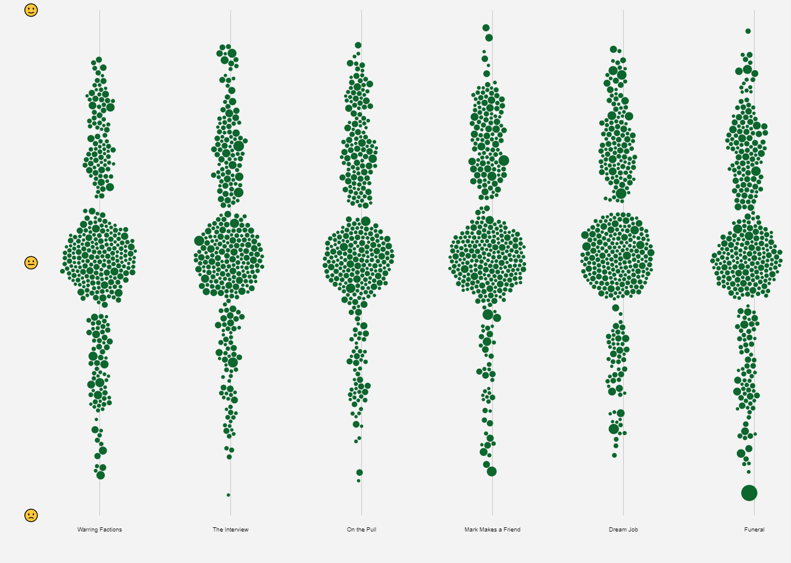

import { FontAwesomeIcon } from '@fortawesome/react-fontawesome'
import { faCamera, faVideo } from '@fortawesome/free-solid-svg-icons'
import MenuVid from '../vid/PeepShowMainMenu.mp4'

We are still in our third lockdown here in the UK and like the rest of the population I've resorted to binge-watching TV shows. This led to me revisiting 
one of my favourite shows of all time, [Peep Show](https://en.wikipedia.org/wiki/Peep_Show_(British_TV_series)). For those that haven't seen it, apart from the 
obvious question of “Why the hell not?”, Peep Show is a comedy series where we follow flatmates Mark Corrigan and Jeremy (Jez) Usborne from one cringeworthy moment to the next as they 
try and navigate their way through the pitfalls of life. Sounds like the premise for a lot of other shows, granted, but the twist with Peep Show is that we are privy to the main character's internal 
thoughts, coupled with a unique point-of-view filming style, makes for, in my humble opinion, one of the greatest comedy creations ever. If you beg to differ, well, 
quite frankly [I think it's time you took your leave](https://www.vox.com/2015/12/23/10650876/peep-show-series-finale).

I've re-watched Peep Show innumerous times and there are many reasons why I keep being drawn back to it. There's the awkwardness. Being able to hear the inner 
thoughts and monologues reminds us that we are not alone in feeling inadequate, lost and disappointed with life, which can only provide hope, especially as someone who can 
relate to those feelings a lot! There's the writing with its sardonic wit, absurdity and obscure references (Jonathan Miller, Kenneth Halliwell and Joe Orton, Bernie 
Winters and Schnorbitz, Professor Yaffle, Chesil Beach, Greenham Common, Raj Persaud, The Barchester Chronicles, Venetian Snares, hanging chads... it goes on, full disclosure, 
I had to look all of those up). The chemistry between David Mitchell (Mark) and Robert Webb (Jez) and the quality of acting by the brilliant support cast (honourable 
mentions go to Olivia Colman as Sophie, Paterson Joseph as Johnson, Matt King as Super Hans and Isy Suttie as Dobby). Finally, there's the character traits, although 
emphasised for comedic effect, are certainly shared by all of us in varying degrees. I can wholly relate to Mark's social awkwardness and cynicism but at the same 
time there's definitely a part of me that wants to slack off, join a band and become a “creative”, like Jez. To paraphrase Anthony Bourdain, “There's a guy inside me 
who wants to lay in bed and watch cartoons and old movies all day. My whole life is a series of stratagems to avoid, and outwit, that guy.” This conflict is perfectly 
demonstrated in Peep Show and if it is indeed the case that we all contain multitudes, well, I contain Mark and Jez.

I was determined to make Anthony Bourdain proud by resisting the urge to watch all nine series flat out, so something creative was in order. Then I found that the scripts 
had already been digitised and made available, [thank-you you lovely people](https://transcripts.fandom.com/wiki/Peep_Show), so the idea hit me to try and do some data 
visualisation on the scripts.

### Data Gathering

> <FontAwesomeIcon icon={faQuoteLeft} /> Don't give me mottoes, Jeremy, I want figures, data.
>
> <cite>Mark &mdash; Series 3, Episode 3.</cite>

The script data was easily scraped into a CSV file and luckily, the internal thoughts were marked in parentheses so I was able to parse them appropriately. One of 
my earliest ideas was to see how much Mark and Jez spent with their internal thoughts, so this was a vital piece of data. The scripts also contain scene changes, so with a 
bit of manual work, I was able to scrape the location of each line which could make for some interesting analysis. The only time-consuming part was analysing who the line 
was directed at (the script data only contained the speaker). For the most part you can infer who was being spoken to from the flow of the conversation but at 
certain points I had to revisit the episode to find out exactly who it was. I suppose I could have come up with a more technical solution, but I was already re-watching the 
show so it didn't seem too much of a chore to do this manually, and hey, there's **always** a bit of manual work involved in any good data viz project.

### Visualisation

With such a large amount of data there wasn't going to be a single chart type that would accurately reflect it all. Instead, my idea was to break down the scripts into lower 
levels of granularity starting from overall conversation flows, then to lines, then sentences and finally down to individual words. This approach was inspired by the 
astonishing [Wind and Words project by Impossible Bureau](http://beta.wind-and-words.com/) which visualised Game of Thrones data in a similar way. Unfortunately, the 
live site seems to be down at the time of writing but it's well worth checking back to see if it comes back up at some point in the future, it was a truly outstanding piece of 
work. The [accompanying news article](http://www.impossible-bureau.com/news/wind-and-words) is probably the next best option in lieu of the main site. It at least shows 
how the site was created along with some screenshots.

#### Structure

With a large dataset such as this, which requires focusing in on different parts of the data and utilising different visualisation techniques, the overall structure was 
going to be important. I could have kept it as a simple web page with text descriptions alongside the visualisations but I felt I could do something more interactive. This 
became even more obvious when it came to the [chord diagrams](#chords) which [can be difficult to interpret]
(https://www.visualcinnamon.com/2014/12/using-data-storytelling-with-chord/), so some form of explanation was in order instead of just dumping the visual on the page 
and hoping the user will fathom it out.

I've come across scroll-based interaction before, especially in the context of interactive storytelling. Some of my [favourite](https://pudding.cool/2019/04/eu-regions/) 
[data](https://pudding.cool/2018/01/chyrons/) [visualisations](https://1812.tass.ru/en) have utilised this technique. Scrolling has many benefits due to it being the most 
intuitive method of interaction. We scroll constantly, so a user doesn't have to understand a UI before being able to navigate the visual. It is also lends itself well to 
a narrative. You only scroll in one dimension, progressing from start to end in a linear fashion which enables you to reveal parts of the visual as you go. This was ideal 
when it comes to explaining how to read certain chart types and I could reveal the data slowly to prevent the user becoming overwhelmed. This “linear narrative” also forced 
me to come up with a story to go alongside the data, making it more compelling overall.

I realise this may be a controversial choice, “scrollytelling”, as it's now called, seems to elicit [strong opinions within the data viz 
community](https://medium.com/nightingale/the-past-present-and-future-of-scrollytelling-10dd37dc1003). It should only be used for the right use cases (where there's a 
story to tell, or to aid the user in discovery) and can very easily be implemented badly and we end up [scrolljacking](https://envato.com/blog/scroll-hijacking/). It has 
also become ubiquitous ever since [The New York Times introduced it to the world back in 2012](https://www.nytimes.com/projects/2012/snow-fall/index.html#/?part=tunnel-creek) 
which always invokes an inevitable backlash. I appreciate this but I still felt that this was a good use case for such an approach and I've always wanted to make my own 
scrollytelling data visualisation. I don't think you can truly appreciate the pros and cons of something until you've tried implementing it yourself.

To avoid these pitfalls, it was best to use a tried and tested third party library. There are [quite](https://github.com/sjwilliams/scrollstory) [a 
few](http://scrollmagic.io/) [available](https://1wheel.github.io/graph-scroll/) these days, built upon different frameworks such as jQuery, GSAP or D3, but I decided to go with 
[scrollama](https://github.com/russellgoldenberg/scrollama#scrollamajs) as this utilises the new [Intersection Observer API]
(https://developer.mozilla.org/en-US/docs/Web/API/Intersection_Observer_API) which provides an asynchronous callback that is executed whenever an element enters or exits 
another element (i.e. the viewport). This makes it a more performant option and is part of the W3C Working Draft, which means it has broad cross-browser support and will 
hopefully become the standards compliant way of achieving such things going forward.

#### Conversations

I thought a chord diagram would be a good way to visualise the conversation flows between the characters. This would show who spoke with whom the most and interestingly, 
how long Mark and Jez spent in their own thoughts. They are particularly good when visualising asymmetric flows as your eye is immediately drawn to a chord that narrows.

<figcaption>
    <FontAwesomeIcon icon={faCamera} /> The initial chord diagram.
</figcaption>

I was fairly happy with the first draft. The “mounds” in Mark and Jeremy’s sections clearly show the proportion of time they spent talking to themselves, which is what 
I wanted to portray. However, as most conversations are symmetrical, the chords were all mainly uniform in thickness which limited the efficacy of this chart. This was 
especially evident in the colouring. The chords are coloured based on the category that has the bigger flow, so for example, the flow between Jeremy 
and Mark is given Jeremy’s green colour as Jeremy speaks to Mark more than vice-versa. This might over-emphasise the conversation flow as in symmetrical conversations 
like this one, it was almost evenly split. It would be better if the chord was coloured to show both characters involved in the conversation which required a linear 
gradient.

<figcaption>
    <FontAwesomeIcon icon={faCamera} /> Chord diagram with linear gradient. Now from a quick glance at the chords it is easier to pick out who the conversation was between.
</figcaption>

All that was left was some tidying up and using the scroll-interaction to reveal the chart gradually to aid the user in making sense of the data.

#### Mark and Jez

The only negative I could see with the chords was the skew towards Mark and Jez. They dominate the chart making it hard to pick out the other characters. This shouldn't have 
been a surprise. Due to the unique way Peep Show is made, Mark and Jez are involved in almost every single line, but the chart made it clear that the lines for 
Mark and Jez warranted their own analysis.

I was looking for text visualisation inspiration when I came across [this beautiful book by Hanna Piotrowska](https://www.behance.net/gallery/83315693/Italo-Calvino-text-data-data-visualization-book). I 
was struck by the many different, unique ways of visualising the text. I particularly enjoyed the sentences visualisation which beautifully combines different glyphs such as 
bars, circles and lines to dig into the structure of the sentences. Even with these simple glyphs, a lot of data is encoded such as chapter, number of sentences, 
sentence length, average number of words, vocabulary density and dialogue vs non-dialogue proportion. This is a great example of [Tufte's data-ink ratio rule]
(https://thedoublethink.com/tuftes-principles-for-visualizing-quantitative-information) which states that a good graphical representation should limit the use of “ink” to 
represent the data only, minimising any redundant extraneous detail, or “[chartjunk](https://www.edwardtufte.com/bboard/q-and-a-fetch-msg?msg_id=00040Z)”. 

I decided to use this design to visualise just Mark and Jez's lines, separating them by episode. This was also another chance to visualise the internal vs external part of the 
data which I felt was a really interesting aspect. The horizontal bars also reminded me of audio visualisation, as if we are visualising the actual audio of the characters 
speaking, which is why I decided to combine them with some audio snippets for extra interactivity.

<figcaption>
    <FontAwesomeIcon icon={faCamera} /> Mark versus Jez analysis.
</figcaption>

I was pleased with how this chart came out as it reveals some interesting pieces of the data at a finer “episodic” level of granularity. It shows the proportions of 
internal vs external lines, particularly how each character compares with the other. The average word length shows that Mark probably does have the better vocabulary. The 
bars really emphasise any outliers (lines with lots of words) which makes for interesting secondary analysis. I combined most of these with audio snippets as they were 
often the most amusing lines in the show. Finally, the top nouns reflect the general theme of the episode from that character's point of view.

#### Sentences

The next level down was to analyse the individual sentences. I had the idea at the beginning of the project to do some sentiment analysis to see which characters exhibit 
which emotions (is Mark always angry and stressed? Is Jez always laid back?), so this seemed the ideal place to do this. Natural language processing (NLP) is difficult, even 
more so when subtle comedy irony is involved, so for time's sake the initial version uses the [nltk Python package](https://www.nltk.org/) to get a simple overall 
positive/negative sentiment score per sentence, but in the future, I would like to incorporate other emotions.

Each sentence was then visualised as a bubble where the size is the number of words in that sentence, the x-axis position being the episode and the y-axis position the sentiment 
score. The bubbles were “jittered” using [D3's force simulation function](https://github.com/d3/d3-force#simulation) to prevent any overlap.

<figcaption>
    <FontAwesomeIcon icon={faCamera} /> Sentiment analysis visualisation.
</figcaption>

With such a mass of bubbles, techniques such as tooltips and filtering were utilised to aid users with their exploration. Also, as the data clusters around the neutral mark 
spotting an overall sentiment trend was difficult. Therefore, I thought it would be worth grouping the bubbles per character and calculating an average sentiment score. Instead 
of bubbles, avatars made more sense here as we are at the character level and I decided to connect them with lines so you can get a sense of the series trend that was hidden 
in the mass.

<figcaption>
    <FontAwesomeIcon icon={faCamera} /> Average sentiment per character. Trends and outliers become more obvious here, what was going on with Jeff in episode 5?
</figcaption>

#### Words

Finally, we get to the individual words. This section needs more work. I started by finding the most commonly used words throughout the series. This involved removing any 
stop words (such as “a”, “the”, “is”, “are” etc.) to try and find actual, interesting words instead of the most common words used in everyday parlance. The first series 
looked OK, words like “really”, “maybe”, “fine”, “actually”, “sure” portrayed, to me at least, a sense of ambiguity as a result of the conflict between Mark and Jez’s internal 
thoughts and what they end up saying. The problem was these words stayed pretty much the same throughout the other series, which didn’t make for an interesting 
insight. Instead, I'm going to try some theme extraction to see if any interesting story arcs appear in the data, but this will take some more time.

This just leaves a word search feature for now. Whilst not quite data visualisation, I think it provides a nice way for users to explore the data by looking for key words or 
phrases. Plus, some of the lines are hilarious when taken out of context.

<figcaption>
    <FontAwesomeIcon icon={faCamera} /> Who can forget pepper-spray-gate?
</figcaption>

#### Alpha Release

The [initial alpha release](/peep-show-viz) is now available for testing and [feedback](https://github.com/Poc275/peep-show-viz/issues/new). There are issues with the responsive layout (it has only been tested on a 1920x1080 desktop screen), media 
playback pausing, transitions not completing during scrolling and transitioning between visuals when scrolling back up screen. There are also features I want to change and some 
new visualisations to incorporate.

##### Main Menu

With such a large amount of data it made sense to focus in on the individual series to break it down (although I'd still like to visualise how the characters developed 
over the entire show somehow). A menu of some kind was therefore needed to navigate between each series. An accordion layout was the initial idea but I decided against this 
approach for a couple of reasons: Firstly, I couldn't find high resolution images for each series. Although it may look reasonable here, some of the images didn't look 
great at full screen size. Secondly, I expected users would want to flip between series more easily than having to go back and forth between a full screen menu. What 
is required is a subtle menu bar which enables users to explore the data and flip between series at the same time. This is planned for the beta release.

<video controls="controls">
    <source src={MenuVid} type='video/mp4; codecs="avc1.42E01E, mp4a.40.2"' />
</video>
<figcaption>
    <FontAwesomeIcon icon={faVideo} /> Initial main menu.
</figcaption>

##### Locations

I still haven't found a satisfactory way of visualising the location part of the data, which shows where abouts the line was said. I thought it could be interesting to see 
how many lines were based inside the flat (the flat is almost a character in itself) compared to outside. My first idea was to use a kind of radial bubble chart where each 
bubble was a location sized by the number of lines. You could then visualise how each episode progressed by reading around the circumference. Unfortunately, I didn't think 
this portrayed anything particularly interesting about the data. Larger bubbles from long scenes based at the same location clouded the chart too, making it hard to extract 
anything useful. Back to the drawing board on this.

<figcaption>
    <FontAwesomeIcon icon={faCamera} /> Locations visualisation.
</figcaption>

##### Timeline

I had included a simple timeline visualisation which shows where characters appear and for how long. Again, I wasn't convinced this portrayed enough detail, plus finding 
out which characters appeared in which episodes could be deduced from some of the other visuals. The plan is to somehow modify this to visualise character's development 
over the entire show.

<figcaption>
    <FontAwesomeIcon icon={faCamera} /> Series timeline. The dot represents when the character first appeared and the line ends where 
    they had their last line.
</figcaption>

<figcaption>
    <FontAwesomeIcon icon={faCamera} /> Timeline per episode.
</figcaption>

##### Other Ideas

I have some other ideas for visualisations that I'd like to add in the future such as vocabulary; I suspect Mark is the better wordsmith, is this true? More “inner thoughts” 
analysis such as which characters cause Mark and Jez to ruminate the most. Some grammar analysis and the question every Peep Show fan wants the answer to, the number 
of “El Dude Brother” salutes.

<figcaption>
    <FontAwesomeIcon icon={faCamera} /> Ehhhhhh! Ehhhhhh!
</figcaption>

Stay tuned for more updates and I'd be really pleased to hear any feedback, good or bad! Either via a [GitHub issue](https://github.com/Poc275/peep-show-viz/issues/new) or 
[more informally](mailto:poc275@gmail.com). The [script dataset](/peep-show-script-data.csv) is also available for anyone else who'd like to partake in such shenanigans.