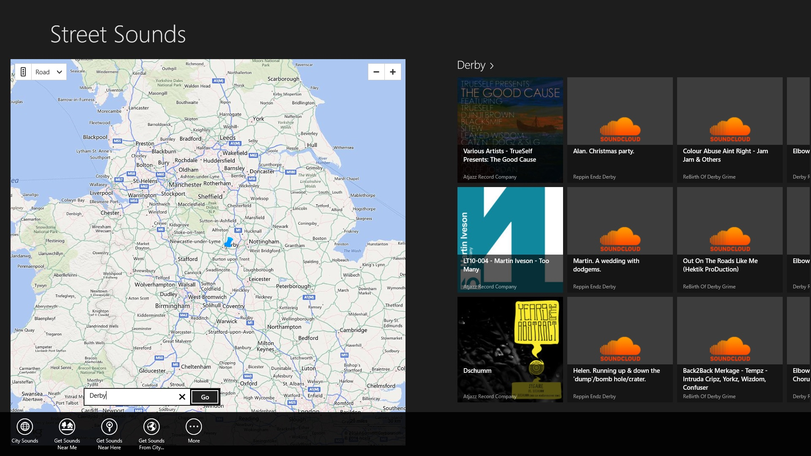

import { FontAwesomeIcon } from '@fortawesome/react-fontawesome'
import { faCamera } from '@fortawesome/free-solid-svg-icons'

This was an exciting project as it gave me the chance to develop for the latest Windows 8 operating system. The brief was just to create 
something ‘cool’ (leaving just enough rope to hang myself with). Looking back, this proved to be an excellent form of motivation. Definitive 
briefs can often stifle innovation as you simply work through each requirement. I found that with a looser set of requirements I was more 
inclined to keep adding functionality as there was just enough doubt there as to what constituted a good application.

As music is one of my passions, I was interested in creating a music based application. Couple this with one of 
[my favourite music sites](https://soundcloud.com/) and we have a good starting point. One of my first ideas was for a way of people to find 
information about street musicians that they come across. This required some form of geo-location functionality which was provided by Bing Maps.

<figcaption>
    <FontAwesomeIcon icon={faCamera} /> Searching for local music using geo-location.
</figcaption>

One of the projects long running issues was the lack of attributes that the musicians apply to their music. Tracks uploaded to SoundCloud have 
many useful fields to fill in, unfortunately they are not mandatory and many are free-entry fields, which give a disparate range of search 
results when you try and query for such things as street musicians.

The lack of street musicians on SoundCloud resulted in the project evolving into a broader music discovery application whilst still retaining 
the location functionality. Users can browse for sounds near their current location, from a random point on the map, from a specific city, or 
they can just view the most popular or most recent tracks on SoundCloud and see where on the map they are from.

<figcaption>
    <FontAwesomeIcon icon={faCamera} /> The home screen displays the current hottest tracks on SoundCloud from your favourite genre.
</figcaption>

From a programming perspective, the built-in Visual Studio templates made sticking to the Windows Store design philosophy straight-forward. The 
majority of the work was spent creating the data model, this made data-binding to the template controls relatively simple. The application is 
written in C#/XAML and utilises the Model-View-View Model (MVVM) pattern.

<figcaption>
    <FontAwesomeIcon icon={faCamera} /> Now playing screen showing integration with the Windows Charms for sharing tracks.
</figcaption>

The application passed the Windows Certification Test but unfortunately it will not be appearing in the Windows Store due to changes in the SoundCloud 
API that now cause the geo-tagging features to be ignored. This proved to be a valuable lesson in using third party APIs! However 
[I’ve made the code available](https://github.com/Poc275/StreetSounds) as it may still prove useful to anyone interested in developing Windows Store 
Apps using the SoundCloud API.