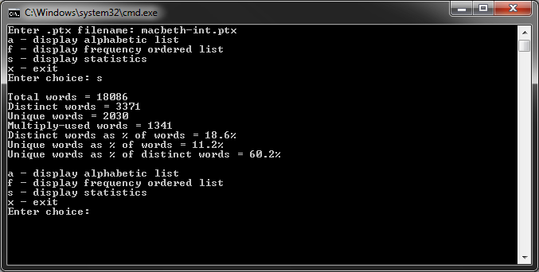

import { FontAwesomeIcon } from '@fortawesome/react-fontawesome'
import { faCamera } from '@fortawesome/free-solid-svg-icons'

This application is a primitive text analysis tool that aims to help with authorship attribution, which is the process applied to documents to try 
and identify their authors. The idea being it can help identify forgeries and help identify genuine authors of unknown works. This computer based 
analysis being just one tool in this process.

The application reads an input .txt file and produces an intermediate file which has one word per line with all punctuation removed. This intermediate 
file can then be used for further analysis.

The application was then extended to read the intermediate file and calculate the frequency distribution of distinct words. The analysis report had to 
print the words in order of frequency, with words which occur an equal number of times being displayed in alphabetical order. Other rudimentary 
statistics were also calculated including the total number of words, the total number of distinct words, and the total number of unique words.


<figcaption>
    <FontAwesomeIcon icon={faCamera} /> Text analysis results of Shakespeare's Macbeth.
</figcaption>

Various data structures were researched to accomplish this, the final choice being a binary search tree. This is a tree with a data item and two 
pointers to other nodes in the tree, the left and right. Every value in the left sub-tree of a node is smaller than the value of that node, every 
value in the right sub-tree is greater than (or equal to) it. The beauty of this data structure is that it sorts unsorted data as it is entered.

The intermediate file was read into the tree which contained the actual word along with its count (achieved through the use of a struct). The tree 
can then be crawled to see if the word already exists, if it does, the count is incremented, if it isn’t, a new node is created for that word with 
a count of one. This data structure provided the flexibility required as it enabled the analysis to report by word frequency or alphabetically. The 
algorithm to create/crawl/search the tree utilised recursion as shown below:

```
Node* addNode(Node* tree, Node* toAdd)
{
    if (tree == 0)
    {
        return toAdd;
    }
    else
    {
        if (toAdd->wordCount->word < tree->wordCount->word)
        {
            tree->pLeft = addNode(tree->pLeft, toAdd);
            return tree;
        }
        else if (toAdd->wordCount->word == tree->wordCount->word)
        {
            tree->wordCount->frequency++;
            return tree;
        }
        else
        {
            tree->pRight = addNode(tree->pRight, toAdd);
            return tree;
        }
    }
}
```


<figcaption>
    <FontAwesomeIcon icon={faCamera} /> Macbeth word frequency analysis results.
</figcaption>


<figcaption>
    <FontAwesomeIcon icon={faCamera} /> A government document word frequency analysis. Although only primitive analysis is carried out by this 
    application, it is clear when compared with the Shakepseare analysis which one is using plainer English!
</figcaption>

The analysis of the algorithm highlighted that an evenly balanced tree search effort is `O(log N)` and insertion effort is `O(N log N)`. In a worst case 
uneven tree this degenerates into `O(N2)` for insertion and `O(N)` for search, which is the same as a linked list.