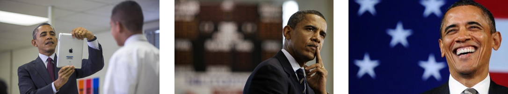
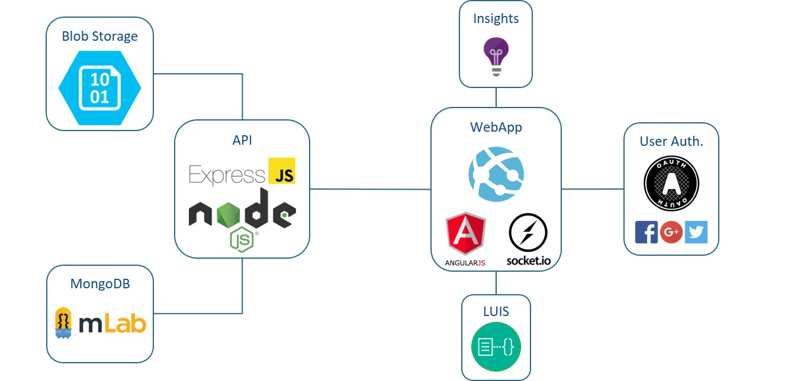
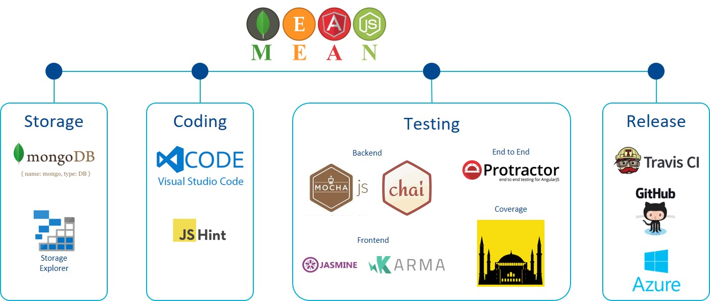

import { FontAwesomeIcon } from '@fortawesome/react-fontawesome'
import { faCamera, faVideo, faQuoteLeft } from '@fortawesome/free-solid-svg-icons'
import loginGif from '../images/login-screen.gif'
import obamaFront from '../images/obama_card_front.jpg'
import obamaRear from '../images/obama_card_rear.jpg'

### Six months earlier... 🍺

I was down the pub with a group of friends, Brexit was a painful, not so distant memory and The Donald had just lost the popular vote to become 
the 45th President of the United States. Over a drink and multiple “How has this happened?” platitudes bordering on the absurd we decided to don 
our geek capes (hats? costumes?) and do something about it. This is how revolutions start, right? Hardly Lenin in Vienna, but in our own indomitable 
fashion we set about making our dent in the world.

<figcaption>
    <FontAwesomeIcon icon={faCamera} /> Drinks were imbibed | It got political | Disillusionment inevitably followed.
</figcaption>

We decided that reminding people that, although it may be a bad time now, there are people out there that can still provide us with hope in this 
post truth world. With Donald Trump victory rallies piercing the background it was inevitable 😊 that we’d converge on the old card game “Top Trumps” as 
the format for our nascent showcase of extraordinary human beings. For those souls fortunate enough not to remember the dark days of games that aren’t 
played on computers, Top Trumps is a card game where a deck of cards is based on a certain theme (usually cars) and each card is scored on certain 
categories (top speed, horsepower, size etc.) with the aim being to compare these values to try and “trump” the opponent’s score and win the card. A 
web-based revamp of this alleged classic game was in order, Top Heroes was born! 🍾

<figcaption>
    <FontAwesomeIcon icon={faCamera} /> An idea forms | The pondering stage... | World domination must surely follow!
</figcaption>

### More drink... 🍻

We set about designing the solution. It needed to be dynamic and fast, the standard web request/response model wasn’t going to cut it.

><FontAwesomeIcon icon={faQuoteLeft} /> I’ve heard about this cool new JavaScript framework that we could use...

<blockquote className="quote-response"><FontAwesomeIcon icon={faQuoteLeft} /> All the cool kids are using that.</blockquote>

><FontAwesomeIcon icon={faQuoteLeft} /> Yeah it’s great for making to-do lists, but will it work for what we need?

And before you knew it we’d assembled enough of the latest cool tools and frameworks that would make a tech talk presenter vomit in excitement.

<figcaption>
    <FontAwesomeIcon icon={faCamera} /> At the core of the solution is the MEAN stack: MongoDB, Express, AngularJS, Node.js.
</figcaption>

Back in the post-pub, relentless real world the solution was surprisingly still coherent. The MEAN stack would mean a single language (JavaScript) 
throughout the application, both server and client side, and we could therefore be sure that each part of the stack would talk to each other easily. Node.js 
would gives us high throughput and scalability via its non-blocking event-driven paradigm. This is done through the use of callbacks, notifying us when 
a task is complete meaning it can process other requests instead of blocking until completion. All of this without having to make the Faustian 
pact with threads. Using Express on top of Node.js provides a nice web framework that makes it easy to build an API. The data model is relatively 
straight-forward with collections in MongoDB for cards and users. I found the NoSQL approach meant we could get up and running quickly with a database, but 
it was easier for redundancy to creep in which a traditional SQL approach would have caught through normalisation. The schema-less nature helped during the 
early development stages, but eventually most data is structured, ours being no different, so Mongoose was used as an ORM providing data validation.

<figcaption>
    <FontAwesomeIcon icon={faVideo} /> Login screen mobile view.
</figcaption>

On the client-side Angular.js gave us the ability to make a dynamic web application. By making AJAX requests under the hood to update the game whilst in 
progress the users are under the impression that it is a “live game” and they’re not presented with a page refresh every time data needs updating. The 
MVC approach in Angular.js is familiar to most web developers which helped get up to speed quickly. The only barrier being the full indoctrination into 
how things are named, and features such as directives are tricky to get right (that dreaded context), but the idea behind it was sound (meaningful HTML 
tags controlling their own behaviour) which ultimately made it worthwhile as you end up with a nice separation of concerns and semantic markup. The UI was 
created using the excellent Angular.js material library which provided UI controls inspired by the Google Material Design language. Socket.io was used to 
provide real-time communication between the players during a game.

<figcaption>
    <FontAwesomeIcon icon={faCamera} /> Barack Obama's Top Heroes card ‐ front.
</figcaption>

<figcaption>
    <FontAwesomeIcon icon={faCamera} /> Barack Obama's Top Heroes card ‐ rear.
</figcaption>

We decided to make use of Azure as our hosting platform. This way we could scale when the disaffected masses came calling to play. Azure Web Apps was used 
to host the application. This PaaS offering meant that we didn’t have to worry about setting up and maintaining infrastructure. Azure Blob Storage was used 
to host the static content. The database was hosted elsewhere, the MongoDB offering in Azure, Cosmos DB, being too expensive for our needs, so we settled 
for mLab’s free tier. Continuous integration was set up using TravisCI which built the app and ran the tests. This then deployed to Azure to complete the 
continuous deployment pipeline. This eventually morphed into a Docker image on a Linux container in Azure which we found to be much faster and just as easy to deploy.

<figcaption>
    <FontAwesomeIcon icon={faCamera} /> Tools used during development showing the CI/CD pipeline.
</figcaption>

### // TODO

Top Heroes is still in development and will hopefully be released soon.

I felt the in-game play could be clunky at times due to it being a web app and the layout not being optimal at certain breakpoints. I’ve been playing with the 
cross-platform framework [Flutter](https://flutter.io/) lately and I’m tempted to port it to an Android/iOS app. This can consume the API of the application already 
built so it’s just another front-end in essence.

The fact that only a single user can play a card at any one time provided a tricky UX problem. How could the user not in play be sure what was happening? If 
the user in play took too long the other player was likely to quit. In game chat was implemented to facilitate the players talking to each other to try 
and alleviate this, and also provides some of the essence of the old game where players can talk about their cards. A future improvement could be a timer 
to limit the time spent playing a card.