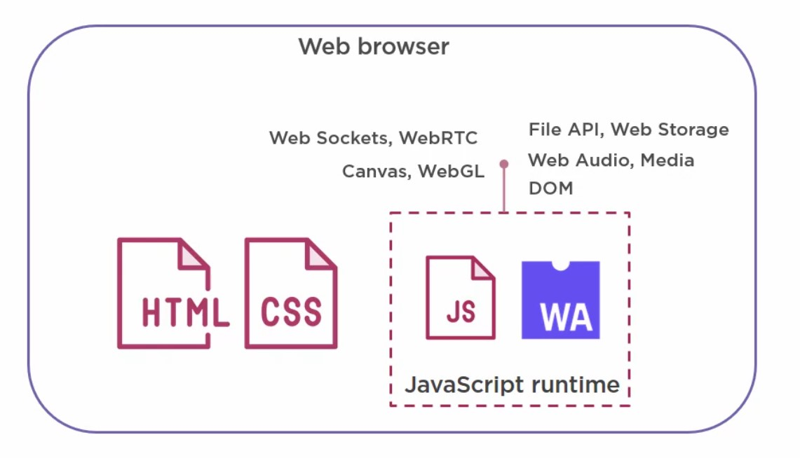
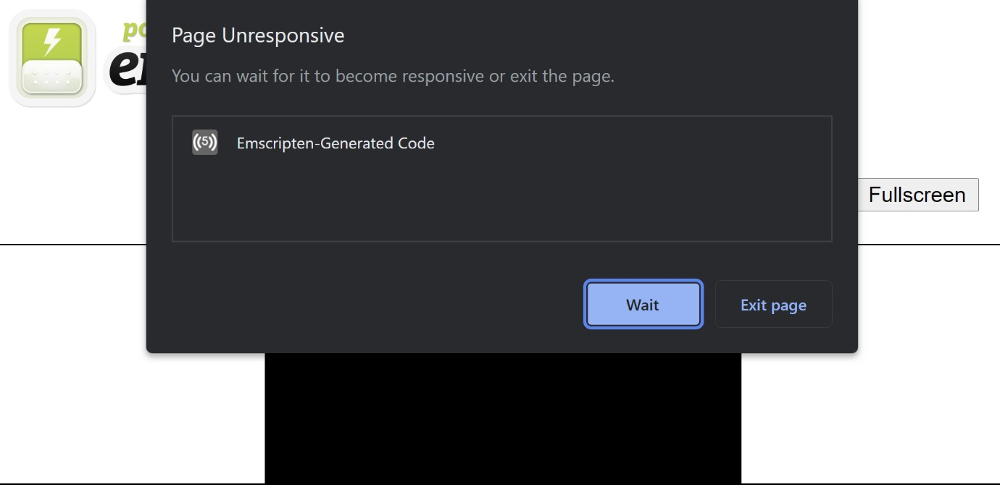

import { FontAwesomeIcon } from '@fortawesome/react-fontawesome'
import { faCamera } from '@fortawesome/free-solid-svg-icons'

I’ve been following the world of WebAssembly (Wasm) for a while now without getting the chance to get my hands dirty. My excitement 
primarily stems from the fact that Wasm is a [W3C officially supported language](https://www.w3.org/TR/wasm-core-1/), making it a core language of 
the web alongside HTML, CSS, JS (and SVG), i.e. no plugins (Flash, Silverlight). I know predictions are futile, especially in the tech world, 
but I believe this will be the key differentiator in Wasm’s future popularity.

### Quick Background

Wasm is a binary format that can be run in the browser. The goal behind Wasm is to create a web-based language that is more performant and 
portable than JavaScript. Unlike JavaScript, Wasm doesn’t have to be interpreted, it just executes, making it faster. Wasm is just code, 
like JavaScript, so it can run in the same JavaScript runtime giving it the same sandboxed security and access to the same APIs (via JavaScript calls).


<figcaption>
    <FontAwesomeIcon icon={faCamera} /> Wasm Architecture (source: <a href="https://app.pluralsight.com/library/courses/web-assembly-big-picture/table-of-contents">Barry Luijbregts</a>).
</figcaption>

Wasm by itself doesn’t provide any Web-specific functionality, it has been designed to be platform agnostic, which gives it that portability. Under the 
hood, the Wasm runtime is a stack-based VM, like the <abbr title="Java Virtual Machine">JVM</abbr>, which makes it a compelling compilation target as well as 
giving it the ability to execute in other environments. This design, coupled with the performance benefits of Wasm, has led to an exciting ecosystem of Wasm 
runtimes such as [Wasmer](https://wasmer.io/) and [Wasmtime](https://wasmtime.dev/) that run outside of the web. APIs such as [WASI](https://wasi.dev/) can 
also bring file access and networking to non-web environments which has led to the rise 
of [Wasm containers](https://www.docker.com/blog/why-containers-and-webassembly-work-well-together/).

Importantly for the web, the fact that Wasm is a target for compilation brings with it lots of possibilities. In fact, Wasm isn’t really intended to be 
written by hand, rather as a compilation target for other languages such as C, C++, Rust etc.  This is another major reason behind my excitement as 
it opens out the web to different types of applications that it couldn’t run in the past.

It isn’t intended to be a JavaScript replacement, just to compliment it for specific use cases where performance is an issue. JavaScript can run Wasm 
modules, this way you can pass off computationally intensive operations onto Wasm to speed up your applications. The implications of this are huge, 
introducing new use cases to the web such as bringing other languages into the browser ([Blazor](https://dotnet.microsoft.com/en-us/apps/aspnet/web-apps/blazor)), 
audio/video editing/streaming, gaming, video calling, VR/AR, AI/ML etc. that could not have been possible before due to the limitations of JavaScript.

### Time to get my hands dirty...

As a decent introduction to Wasm I decided to try and port my [3D Software Renderer](https://poc275.me/3d-software-renderer/) to the web. This was written 
in C++ so I decided to use [Emscripten](https://emscripten.org/index.html) which is a compiler that can compile C++ into Wasm. It basically is a drop-in 
replacement for a standard compiler like gcc or clang. Simple, install Emscripten and compile it to Wasm right? Well, not quite...

#### Graphics

The original renderer uses the [GDI+ API](https://learn.microsoft.com/en-us/windows/win32/gdiplus/-gdiplus-gdi-start), which is an interface for Windows 
Apps to draw device independent graphics. This isn’t an option on the web. Emscripten targets WebGL/OpenGL but also supports the 
[Simple DirectMedia Layer (SDL) library](https://www.libsdl.org/). This is a cross-platform library providing low level access to the graphics 
hardware. The renderer makes use of low level graphics primitives such as vertices and pixels, plus SDL works natively with C++, so I decided to use this 
as the GDI+ replacement.

The conversion wasn’t as onerous as I expected. Being low-level, there was always a direct one-to-one mapping available between GDI+ and SDL (v2). E.g. 
`SDL_RenderDrawLine()` instead of `Graphics->DrawLine()` for lines, `SDL_RenderGeometry()` instead of `Graphics->FillPolygon()` for drawing triangles, 
and `SDL_RenderDrawPoint()` instead of `Bitmap->SetPixel()` for rendering pixels.

#### Models and Textures

The original renderer uses the .MD2 model format. The code to load MD2 files remained the same, the only issue being how to access the file system to load it? 
Obviously on the web, accessing the local file system is a big no-no. Instead, Emscripten provides a virtual file system that simulates the local file system, 
meaning your C/C++ code that makes use of file APIs such as `iostream` and `fstream` can be compiled without requiring any major changes.

The only change required was to package the required files at compile time. This was simply a case of adding the `--preload-file` argument to the compiler 
and pointing it to a folder containing the models and textures. This generates a .data file containing all of the files in that directory which is then 
mapped to the virtual file system. The generated JavaScript code then takes care of loading the files.

Texturing required some minor changes. As texturing is basically just selecting a specific colour from a texture map and applying that to a pixel, I 
had to replace the GDI+ `Color` class with `SDL_Color`, but again being low-level, the classes accept the same RGBA arguments so this was extremely simple.

#### Main Loop

The renderer uses an infinite event loop to redraw and update the image. This brings it into direct conflict with the JavaScript event loop which waits 
for events, runs them, and returns control back to the browser. The problem is that the renderer will never relinquish control back to the JavaScript 
event loop, so the browser cannot accept any more events, and the whole page becomes unresponsive.


<figcaption>
    <FontAwesomeIcon icon={faCamera} /> Native event loop conflict with the JavaScript event loop causing the page to become unresponsive 
    (<a href="https://web.dev/drawing-to-canvas-in-emscripten/">source</a>).
</figcaption>

To fix, use the `emscripten_set_main_loop()` method. Under the hood this uses the 
[`requestAnimationFrame()`](https://developer.mozilla.org/en-US/docs/Web/API/window/requestAnimationFrame) API to update before the next 
repaint and ensures control is relinquished back to the browser.

#### Setting up your dev environment

It can be tricky to setup a nice dev environment and workflow when doing this kind of work. I found the following to be extremely helpful.

Add the SDL libraries to your Visual Studio solution. This will give you intelli-sense and API info that will help you during development:

1. [Download SDL](https://github.com/libsdl-org/SDL/releases/latest). Ensure you select the ‘VC’ version to get the C/C++ headers and library.
1. In Visual Studio go to Configuration Properties -> VC++ Directories -> Include Directories -> Edit
1. Add the SDL include directory: e.g. `.\SDL2-2.24.0\include`
1. Go to Configuration Properties -> Linker -> General -> Additional Library Directories -> Edit
1. Add the same folder
1. Add the libs, right click on the project, Add -> An existing item -> Navigate to the `.\SDL2\lib\x<86|64>` folder and add these files: 
`SDL2.dll`, `SDL.2.lib` and `SDL2main.lib`. They should now appear in the Solution Explorer.

Then for compiling with Emscripten, use the SDL2 port instead via `-s USE_SDL=2`. This will save you having to point Emscripten at the required SDL libraries.

For any Emscripten specific calls in your code surround with the `#ifdef __EMSCRIPTEN__` preprocessor directive. This way your code will compile 
in both Visual Studio and Emscripten.

For the main loop I found it best to support both native C++ as well as Emscripten. This way you can develop and test inside Visual Studio to get a 
*first pass* and make sure everything is working OK, then you can compile with Emscripten afterward. This will look something like the following:

```cplusplus
void run_main_loop()
{
#ifdef __EMSCRIPTEN__
	emscripten_set_main_loop([]() { handle_events(); }, 0, true);
#else
	while (handle_events())
		;
#endif // __EMSCRIPTEN__
}
```

Here we’re setting the Emscripten main loop (to relinquish control back to the browser as previously mentioned) if compiled using Emscripten, 
otherwise for native runs we just run the loop indefinitely.

### Result

> <FontAwesomeIcon icon={faQuoteLeft} /> The fact that this was a painless process is a testament to the forethought that has gone into Wasm and 
the quality of tools in the Wasm ecosystem, Emscripten in particular.

[Here is the WebAssembly software renderer in action](https://poc275.me/wasm-sw/WasmSoftwareRenderer.html). I haven’t ported all of the original renderer’s features yet such as shadows and fog, and I 
plan to add some controls for users to play around with it which will give me chance to look into calling C++ from JavaScript. Stay tuned for these!

### Sources
- Source code available on [GitHub](https://github.com/Poc275/WasmSoftwareRenderer).
- The GUI used in the demo is courtesy of [dat.GUI](https://github.com/dataarts/dat.gui).
