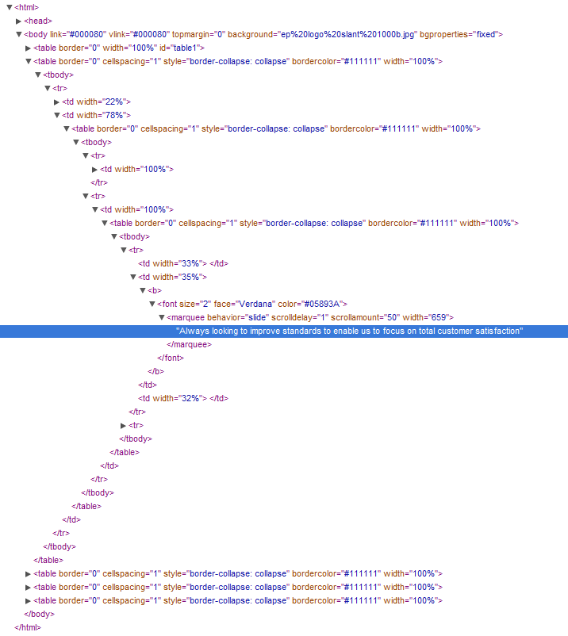

import { FontAwesomeIcon } from '@fortawesome/react-fontawesome'
import { faCamera } from '@fortawesome/free-solid-svg-icons'

This project was focused on client-side web development, involving HTML, CSS and JavaScript. It involved re-designing a local packaging company’s 
website and writing a [report, detailing how the re-design improved upon the original](/extra-packaging-website-report.pdf).

The report focused on the following aspects:

- How well the site adheres to current web standards
- Cross-browser compatibility
- Accessibility & usability
- Search engine optimisation
- Site content in relation to the target audience

One of the major problems with the site was a lack of separation between content and style. The entire structure was created using a HTML 
table, which it isn’t designed for. The CSS was practically non-existent as all of the styling was done inside the HTML. This led to a horrible 
tangle of HTML code that would be extremely difficult to maintain.

<figcaption>
    <FontAwesomeIcon icon={faCamera} /> Source code of the original home page showing the misuse of the table tag.
</figcaption>

This also had a knock-on effect accessibility. By improving the structure of the site and separating content, style and interactivity correctly between 
HTML, CSS and JavaScript, the accessibility of the site improved as screen readers were able to scan the pages and users could modify certain 
aspects such as font size without the layout breaking.

<figcaption>
    <FontAwesomeIcon icon={faCamera} /> Original home page before the redesign. The lack of content hierarchy is perhaps the most striking aspect. The 
    font sizes are all the same which results in a confusing and unpleasant experience. The background image also detracts the user from reading the content.
</figcaption>

This project really opened my eyes to the importance of a well written website. By writing clear, validated mark-up and separating the styling, many 
benefits can be achieved, such as cross-browser compatibility, better search ranking, easier maintenance and improved accessibility. This was a thoroughly 
enjoyable project, I particularly enjoyed the feeling of ‘crafting’ a web page through well written HTML and CSS as up until this point I had only used <abbr title="What You See Is What You Get">WYSIWYG</abbr> editors 
such as Dreamweaver with little appreciation of the code that it created.

<figcaption>
    <FontAwesomeIcon icon={faCamera} /> Redesigned home page. The menu has been replaced with more prominent tabs. Larger font sizes are used for titles to 
    draw the eye around the page. Behind the scenes the markup has been totally revamped using the latest web standards.
</figcaption>