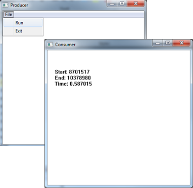
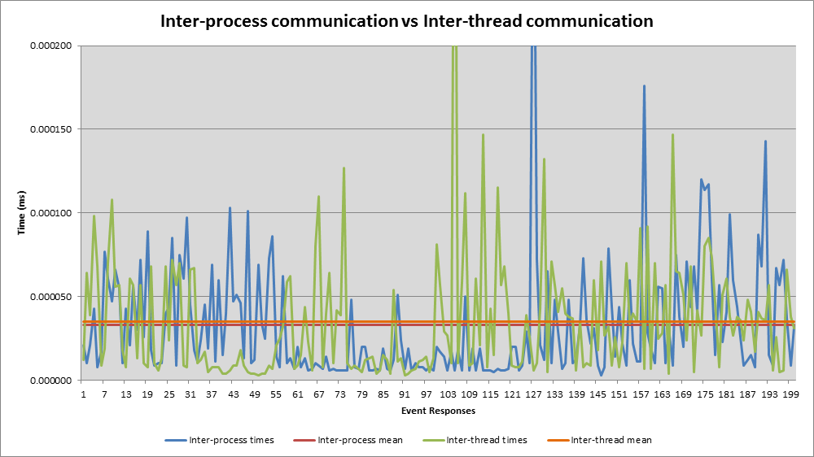

import { FontAwesomeIcon } from '@fortawesome/react-fontawesome'
import { faCamera } from '@fortawesome/free-solid-svg-icons'

### Comparison of communication between threads and processes using the Windows API

The idea of this particular application was to try and prove some of the theory that had been taught in an operating systems module, 
specifically, the timing differences between <abbr title="Inter-process communication">IPC</abbr> and <abbr title="Inter-thread communication">ITC</abbr>. 
The theory being that threads are quicker to create than processes. However, does this remain true when communicating between threads and processes?

Communication was achieved through the use of events. For IPC, a pair of programs were created, one acting as a producer and the other as 
a consumer. The producer program creates an event and stores the current ‘time’ which is retrieved from the performance counter. The consumer 
program then responds to the event, and reads the performance counter to be able to calculate the duration.


<figcaption>
    <FontAwesomeIcon icon={faCamera} /> IPC screenshot showing producer and consumer programs.
</figcaption>

For the consumer to be able to read the producer's starting time, a memory mapped file was created to enable both processes to communicate:

```
// Memory sharing struct
typedef struct
{
    LARGE_INTEGER startTime;
} MemShare;

// Create Shared Memory
hMapFile = CreateFileMapping((HANDLE)0xFFFFFFFF,
                              NULL, 
                              PAGE_READWRITE, 
                              0, 
                              sizeof(MemShare), 
                              L"MyFileMappingObject");

// Access shared memory (cast to the struct)
memShare = (MemShare*)MapViewOfFile(hMapFile,
                                    FILE_MAP_READ | FILE_MAP_WRITE,
                                    0,
                                    0,
                                    sizeof(MemShare));

// Place start counter in shared memory
CopyMemory((MemShare*)memShare, &start, sizeof(MemShare));
```

The consumer program can then read the shared memory and calculate the time taken to respond to the event:

```
// Wait for event to be signaled
WaitForSingleObject(passedParams->hEvent, INFINITE);

// Get end/freq values as soon as event has been signaled
QueryPerformanceCounter(&end);
QueryPerformanceFrequency(&freq);

// Open shared memory so we can get the start time
hMapFile = OpenFileMapping(FILE_MAP_READ | FILE_MAP_WRITE,
                           FALSE,
                           L"MyFileMappingObject");

// Access shared memory and calculate duration
memShare = (MemShare*)MapViewOfFile(hMapFile,
                                    FILE_MAP_READ | FILE_MAP_WRITE,
                                    0,
                                    0,
                                    sizeof(MemShare));

time = (double)(end.QuadPart - memShare->startTime.QuadPart) / (double)freq.QuadPart; 
```

The ITC testing was done in exactly the same way, although this could be confined to a single program.

The results were surprising, IPC was quicker than ITC, but only slightly. One possible explanation is that the method of IPC implemented (shared memory) 
is in fact the fastest form of IPC. This is because it doesn’t involve any 3rd party function calls, so there is no overhead associated, as opposed to 
other IPC techniques.


<figcaption>
    <FontAwesomeIcon icon={faCamera} /> Overall timing results, the mean shows IPC, surprisingly, is slightly faster than ITC.
</figcaption>

Although this wasn’t my first taste of C programming (if it's yours then you absolutely must start with 
[this book](https://www.amazon.co.uk/C-Programming-Language-2nd/dp/0131103628)), it was my first attempt at programming for Windows. This proved to be 
very different from other programming I had done up to this point. The Windows API uses a lot of structs, very long method calls and special data 
types. For anyone dabbling in such sorcery I highly recommend 
[Programming Windows (5th edition) by Charles Petzold](https://www.amazon.co.uk/Programming-Windows%C2%AE-Microsoft-Series/dp/157231995X/ref=sr_1_2?ie=UTF8&qid=1411315058&sr=8-2&keywords=programming+windows), 
a.k.a. The Bible!